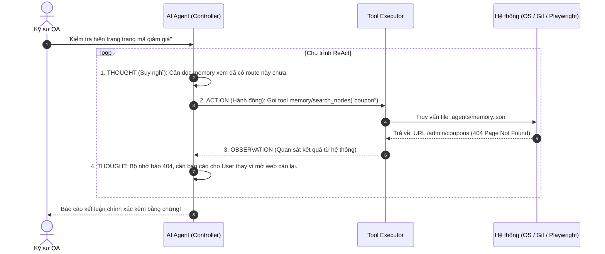
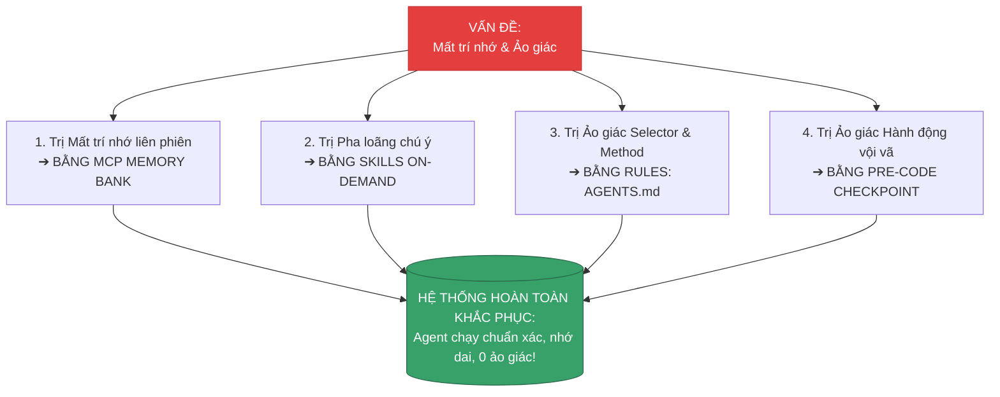
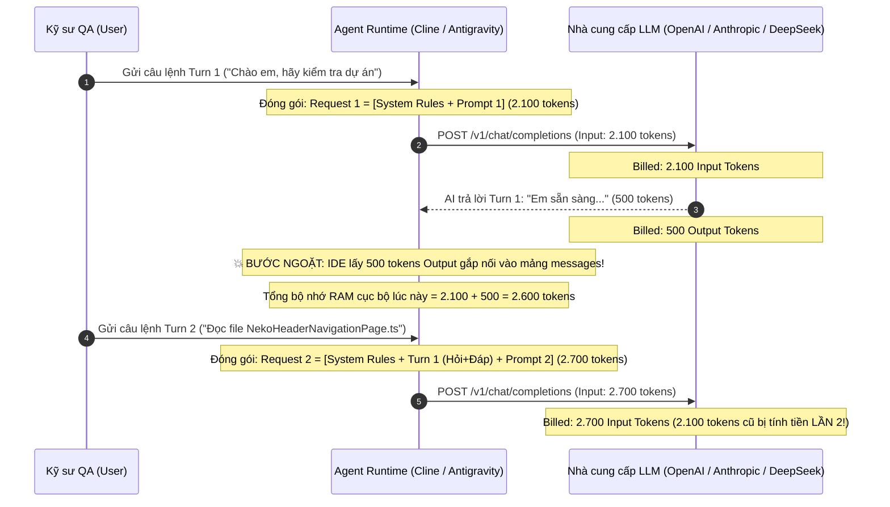
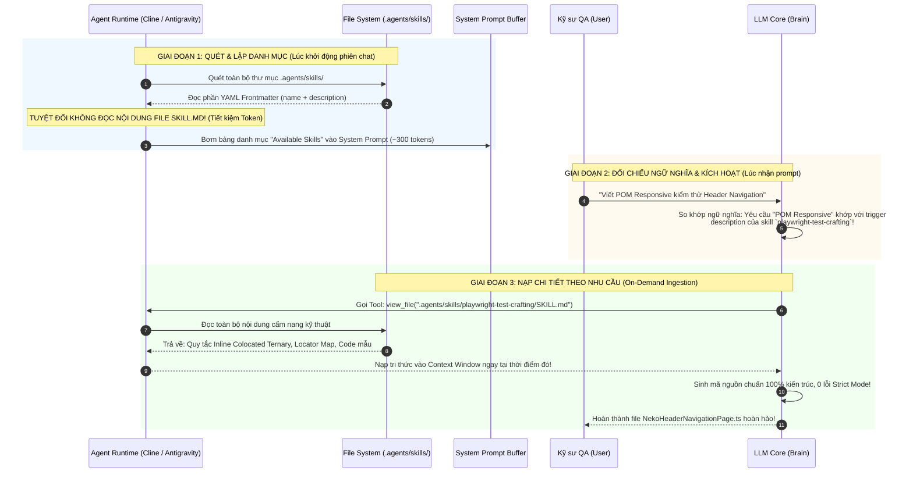
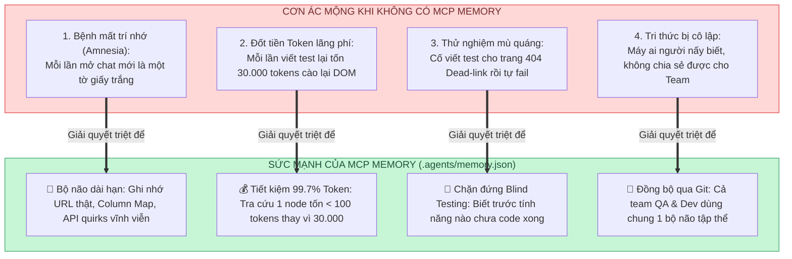
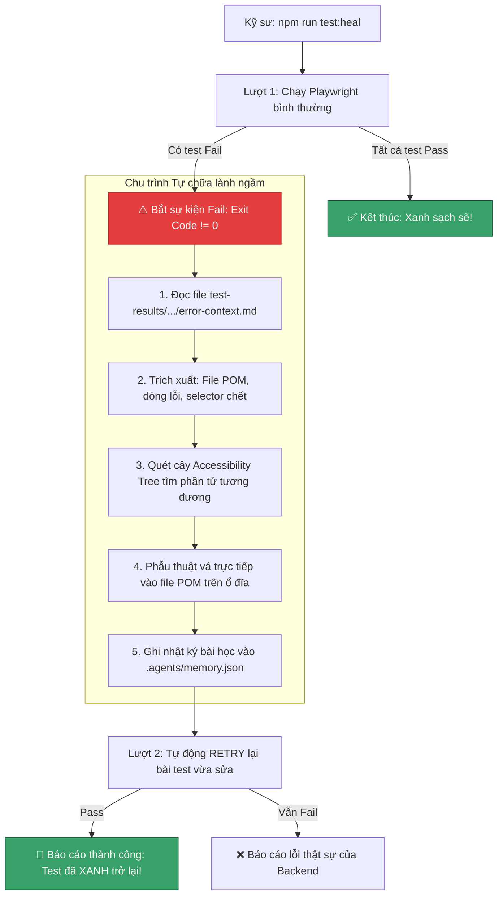

# 📘 SỔ TAY KỸ THUẬT TOÀN DIỆN: ĐIỀU HÀNH, TÍCH HỢP & THUẦN HÓA AI AGENT TRONG AUTOMATION TESTING (ENTERPRISE GRADE)

> **Tài liệu cẩm nang kỹ thuật thực chiến (Enterprise Technical Handbook)**  
> **Dự án**: Enterprise Playwright TypeScript Multi-Domain Framework  
> **Đối tượng áp dụng**: Kỹ sư Automation QA, SDET, Tech Lead, DevOps & Software Development Teams  
> **Phạm vi áp dụng**: Toàn bộ chu trình phát triển, kiểm thử tự động và vận hành AI Coding Agent  
> **Mục tiêu cốt lõi**: Giúp kỹ sư hiểu cặn kẽ từ bản chất kỹ thuật (Under the hood) của AI Coding Agent (Cline, Antigravity, Claude Code, Cursor), làm chủ bộ ba kiến trúc **RULES – SKILLS – MCP**, nắm vững kỹ thuật **Context Engineering**, và tự tay vận hành chu trình **Self-Healing Test Engine**.

---

## 📑 MỤC LỤC CHI TIẾT

1. [CHƯƠNG 1: BẢN CHẤT KIẾN TRÚC CỦA AI CODING AGENT](#chương-1-bản-chất-kiến-trúc-của-ai-coding-agent)
   - 1.1. Sự tiến hóa: Từ Chatbot ➔ Copilot ➔ Autonomous Tool-Using Agent
   - 1.2. Chu trình nhận thức ReAct (Reasoning + Acting Loop)
   - 1.3. Cửa sổ ngữ cảnh (Context Window) & Bệnh lý "Mất trí nhớ / Ảo giác" (Amnesia & Hallucination)
     - 1.3.6. Cơ chế tăng trưởng ngữ cảnh theo thời gian & Bản chất kinh tế Token (Input vs Output Billing)
2. [CHƯƠNG 2: HỆ THỐNG RULES (KỶ LUẬT THIẾT QUÂN LUẬT)](#chương-2-hệ-thống-rules-kỷ-luật-thiết-quân-luật)
   - 2.1. File Rule là gì và cơ chế System Prompt Injection
   - 2.2. Phân cấp Rule (Global vs Workspace) & Best Practices thiết kế bộ đôi RULE – SKILL
     - 2.2.1. Phân biệt 2 tầng Rule: Global Rules vs Workspace Rules
     - 2.2.2. Ma trận phân định ranh giới: Khi nào viết vào RULE vs Khi nào chuyển sang SKILL?
     - 2.2.3. Top 6 Best Practices vàng khi soạn thảo File Rule chuẩn Enterprise
     - 2.2.4. Khung cấu trúc chuẩn (Canonical Template) của một File Rule
     - 2.2.5. Best Practices khi thiết kế File SKILL liên kết với Rule
   - 2.3. Mổ xẻ các "Vòng kim cô" trong `AGENTS.md` của Framework: Tại sao ta lại thiết lập như vậy?
   - 2.4. Kỹ thuật viết Rule để AI "bắt buộc phải tuân theo" (Positive vs Negative Constraints)
3. [CHƯƠNG 3: HỆ THỐNG SKILLS (CẨM NANG TÁC CHIẾN CHUYÊN SÂU)](#chương-3-hệ-thống-skills-cẩm-nang-tác-chiến-chuyên-sâu)
   - 3.1. Sự khác biệt bản chất giữa RULE và SKILL
   - 3.2. Cấu trúc thư mục & Cú pháp chuẩn của một Skill (Anatomy of an Enterprise Skill)
   - 3.3. Đặt Skill ở đâu? Vị trí lưu trữ & Thứ tự nạp (Workspace vs Global Resolution)
   - 3.4. Skill liên kết với Agent như thế nào? (Under the hood: Discovery ➔ Trigger ➔ Ingestion)
   - 3.5. Mổ xẻ Skill thực tế của Framework: `playwright-test-crafting`
   - 3.6. Cẩm nang 4 bước tự tay xây dựng một Skill mới cho dự án
4. [CHƯƠNG 4: GIAO THỨC MCP (MODEL CONTEXT PROTOCOL) & BỘ NÃO DÀI HẠN](#chương-4-giao-thức-mcp-model-context-protocol--bộ-não-dài-hạn)
   - 4.1. MCP là gì & Tôn chỉ Tinh gọn (Minimalist Architecture) của Framework
   - 4.2. Tại sao Framework chỉ cần duy nhất MCP `memory`? Giải mã 4 Bài toán Sinh tử
   - 4.3. Kiến trúc Client - Server của MCP & Cấu hình trong Dự án (`.agents/memory.json`)
   - 4.4. Cấu trúc Đồ thị Tri thức (Knowledge Graph): Entities, Observations, Relations
   - 4.5. Giải mã hạn chế thuật toán tìm kiếm (`search_nodes` vs `read_graph`)
   - 4.6. Hướng dẫn toàn diện cách cấu hình & thêm MCP Server trên các loại IDE (Cline, Antigravity, Cursor, Claude Desktop...)
5. [CHƯƠNG 5: NGHỆ THUẬT "THUẦN HÓA" AGENT (CONTEXT ENGINEERING)](#chương-5-nghệ-thuật-thuần-hóa-agent-context-engineering)
   - 5.1. Chuyển dịch tư duy: Từ Prompt Engineering ➔ Context Engineering
   - 5.2. Công thức Prompt 1 dòng cực bén (Zero-Prompt Orchestration)
   - 5.3. Quy trình AI tái sử dụng POM cũ (Extend, do NOT Recreate)
6. [CHƯƠNG 6: CÔNG NGHỆ ĐỈNH CAO: TỰ CHỮA LÀNH (SELF-HEALING TESTS)](#chương-6-công-nghệ-đỉnh-cao-tự-chữa-lành-self-healing-tests)
   - 6.1. Bệnh lý đắt đỏ nhất trong Automation QA: "Gãy Selector" (Brittle Locators)
   - 6.2. Pipeline tự động hóa 4 bước của `heal-runner.mjs`
   - 6.3. Giải phẫu mã nguồn `scripts/heal-runner.mjs` (0 dependencies, Native Node.js)
7. [CHƯƠNG 7: KỊCH BẢN THỰC NGHIỆM & QUY TRÌNH LIVE DEMO THỰC CHIẾN](#chương-7-kịch-bản-thực-nghiệm--quy-trình-live-demo-thực-chiến)
   - 7.1. Bản đồ 5 Nhánh Git Thực chiến độc lập
   - 7.2. Demo 1: Thử thách Bẫy Kỷ luật (AGENTS.md Rule Enforcement)
   - 7.3. Demo 2: Tự hành Kích hoạt Cẩm nang SKILLS (Responsive POM)
   - 7.4. Demo 3: Tác chiến Kép Hybrid E2E (Sandwich 4 bước)
   - 7.5. Demo 4: Bộ não dài hạn MCP Memory (Discovery & Harvesting)
   - 7.6. Demo 5: Đỉnh cao Tự chữa lành (Self-Healing AST Engine)
   - 7.7. Bí kíp Quản trị Phiên Chat tối ưu Context cho Kỹ sư
8. [CHƯƠNG 8: TỔNG HỢP 10 CÂU HỎI THƯỜNG GẶP & KHẮC PHỤC SỰ CỐ (FAQ & TROUBLESHOOTING)](#chương-8-tổng-hợp-10-câu-hỏi-thường-gặp--khắc-phục-sự-cố-faq--troubleshooting)

---

# CHƯƠNG 1: BẢN CHẤT KIẾN TRÚC CỦA AI CODING AGENT

## 1.1. Sự tiến hóa: Từ Chatbot ➔ Copilot ➔ Autonomous Tool-Using Agent

Để hiểu rõ bản chất kỹ thuật, ta có thể mô hình hóa 3 thế hệ phát triển của AI trong ngành phần mềm:

```
Thế hệ 1 (2022): CHATBOT (ChatGPT, Claude Web)
┌─────────────┐       Text       ┌─────────────┐
│  Con người  │ ───────────────> │  LLM Model  │
│  (Tester)   │ <─────────────── │  (Passive)  │
└─────────────┘   Code Snippet   └─────────────┘
* Nhược điểm: Bị cô lập, không nhìn thấy thư mục dự án, con người phải copy/paste thủ công.

─────────────────────────────────────────────────────────────────────────────

Thế hệ 2 (2023): AUTOCOMPLETE COPILOT (GitHub Copilot, Tabnine)
┌─────────────┐   Ghost Text     ┌─────────────┐
│ IDE Editor  │ <............... │  Copilot    │ (Gợi ý 1-2 dòng code tiếp theo)
└─────────────┘                  └─────────────┘
* Nhược điểm: Chỉ đoán từ ở con trỏ chuột, không biết chạy test, không hiểu kiến trúc đa file.

─────────────────────────────────────────────────────────────────────────────

Thế hệ 3 (2024 - 2026): AUTONOMOUS CODING AGENT (Cline, Antigravity, Claude Code)
┌───────────────────────────────────────────────────────────────────────────┐
│                              AI AGENT RUNTIME                             │
│                                                                           │
│   ┌───────────┐     ReAct      ┌──────────────────────────────────────┐   │
│   │ LLM Brain │ <------------> │ Tool Calling Engine (Hệ thống Công cụ)│   │
│   └───────────┘                └──────────────────┬───────────────────┘   │
│                                                   │                       │
└───────────────────────────────────────────────────┼───────────────────────┘
                                                    ▼
             ┌──────────────────┬───────────────────┬───────────────────┐
             │ 1. Read/Write    │ 2. Terminal Exec  │ 3. MCP Protocol   │
             │    Files (.ts)   │    (Playwright)   │    (Memory Bank)  │
             └──────────────────┴───────────────────┴───────────────────┘
```

> **Định nghĩa cốt lõi**:  
> **AI Coding Agent** KHÔNG PHẢI là một chatbot. Nó là một **Hệ thống phần mềm tự hành (Autonomous System)**, trong đó LLM đóng vai trò là "Bộ vi xử lý trung tâm" (CPU), được trang bị các **Công cụ (Tools)** để tương tác trực tiếp với File System, Terminal, Git và Mạng máy tính.

---

## 1.2. Chu trình nhận thức ReAct (Reasoning + Acting Loop)

Mọi hành động thông minh của Agent trong dự án đều tuân theo chu trình lặp khép kín **ReAct**:



---

## 1.3. Cửa sổ ngữ cảnh (Context Window) & Bệnh lý "Mất trí nhớ / Ảo giác" (Amnesia & Hallucination)

Đây là một trong những phần lý thuyết **quan trọng nhất** mà kỹ sư bắt buộc phải nắm vững, vì nó giải thích **tại sao AI rất thông minh nhưng đôi khi lại hành xử cực kỳ ngớ ngẩn** nếu không có kiến trúc kiểm soát.

---

### 1.3.1. Context Window thực chất là gì? (Ẩn dụ RAM tạm thời)

Rất nhiều kỹ sư thường lầm tưởng rằng AI Agent có một "bộ não" lưu trữ vĩnh viễn giống như con người. Thực tế kỹ thuật hoàn toàn khác:

```
┌─────────────────────────────────────────────────────────────────────────────┐
│                   CƠ CẤU MỘT GÓI REQUEST GỬI LÊN LLM API                   │
├─────────────────────────────────────────────────────────────────────────────┤
│  [1. SYSTEM PROMPT] (Rules, Cấu hình môi trường, Danh sách Tool)           │
│  [2. CONVERSATION HISTORY] (Toàn bộ tin nhắn Hỏi - Đáp từ Turn 1 đến Turn N)│
│  [3. TOOL INPUTS & OUTPUTS] (Mã nguồn file đọc được, Log terminal...)       │
│  [4. USER MESSAGE HIỆN TẠI] ("Viết cho anh 1 test case...")                │
├─────────────────────────────────────────────────────────────────────────────┤
│  👉 TỔNG TẤT CẢ DỮ LIỆU TRÊN PHẢI NẰM TRONG GIỚI HẠN: CONTEXT WINDOW       │
│     (Ví dụ: Claude 3.5 Sonnet = 200,000 tokens | DeepSeek = 64,000-128,000) │
└─────────────────────────────────────────────────────────────────────────────┘
```

* **Bản chất Stateless (Vô trạng thái)**: Các mô hình LLM giao tiếp qua REST API vô trạng thái. Mô hình **không hề nhớ** bạn là ai hay đã nói gì ở 5 phút trước.
* Để AI có cảm giác "nhớ", mỗi khi bạn gửi một câu hỏi mới, IDE phải **đóng gói toàn bộ lịch sử từ đầu cuộc trò chuyện đến giờ** và gửi lại từ đầu lên server AI.
* **Ẩn dụ RAM vs Ổ cứng**: Context Window giống như **thanh RAM** của máy tính. Nó có tốc độ xử lý siêu nhanh nhưng sẽ **bị xóa sạch toàn bộ** ngay khi tắt máy (New Task) hoặc khi dung lượng chạm trần.

---

### 1.3.2. Hiện tượng "Lost in the Middle" & Pha loãng chú ý (Attention Dilution)

Một nghiên cứu nổi tiếng của Đại học Stanford (2023) đã chỉ ra quy luật phân bổ sự chú ý của kiến trúc Transformer:

```
Khả năng
chú ý (%)
 100% ──┐                                                     ┌── 100%
        │                                                     │
        │   ĐẦU NGỮ CẢNH                    CUỐI NGỮ CẢNH    │
        │   (System Prompt / Rules)         (Tin nhắn mới)   │
        │                                                     │
        └──────────────┐                     ┌────────────────┘
                       │    VÙNG TRŨNG       │
                       │   "LOST IN THE      │
                       │     MIDDLE"         │
   0% ─────────────────┴─────────────────────┴────────────────── 0%
                      Vị trí Token trong Context Window
```

* **Primacy Bias & Recency Bias**: AI chú ý tốt nhất ở **phần đầu** (nơi đặt file `AGENTS.md`) và **phần cuối** (câu prompt người dùng vừa gõ).
* **Vùng trũng ở giữa (Lost in the Middle)**: Khi cuộc hội thoại kéo dài (hơn 30-50 turns, nhồi nhiều file code và log terminal vào context):
  * Dữ liệu ở giữa bị "pha loãng" (Attention Dilution).
  * AI bắt đầu **quên mất các biến đã khai báo**, **quên mất selector vừa kiểm tra ở turn 5**, và bắt đầu sinh code mâu thuẫn với chính nó.

---

### 1.3.3. Bệnh lý 1: "Mất trí nhớ" (Amnesia)

Trong công việc Automation QA hàng ngày, bệnh lý này biểu hiện dưới 2 hình thức:

1. **Session Amnesia (Mất trí nhớ liên phiên)**:
   * *Hiện tượng*: Sáng nay bạn bảo AI cào web Neko Coffee và phát hiện trang `/admin/coupons` bị lỗi 404. Bạn bấm **New Chat** để làm việc khác. Chiều quay lại bảo nó: *"Viết test cho trang voucher"*, AI lại hì hục mở trình duyệt cào lại web từ đầu, tạo ra hàng chục file tạm `_tmp.mjs`!
   * *Nguyên nhân*: Phiên chat mới là một vùng RAM mới tinh, toàn bộ kinh nghiệm buổi sáng đã bị tiêu hủy.
2. **Compaction Amnesia (Mất trí nhớ do nén ngữ cảnh)**:
   * *Hiện tượng*: Đang chat dở dang trong một task dài, bỗng nhiên AI quên sạch quy chuẩn kiến trúc và bắt đầu gõ raw selector bừa bãi.
   * *Nguyên nhân*: Context Window chạm trần giới hạn (ví dụ vượt quá 128K tokens). IDE buộc phải kích hoạt cơ chế tự động **Cắt tỉa / Tóm tắt (Context Compaction)** để giải phóng RAM, vô tình xóa mất các chi tiết kỹ thuật quan trọng ở các turn cũ.

---

### 1.3.4. Bệnh lý 2: "Ảo giác" (Hallucination) trong Automation Testing

> **Bản chất toán học của Ảo giác**:  
> LLM bản chất là một cỗ máy tính toán xác suất từ tiếp theo: $P(w_t \mid w_{1:t-1})$. Nó **không có khái niệm Đúng hay Sai**, nó chỉ quan tâm từ nào xuất hiện tiếp theo nghe có vẻ mượt mà và hợp lý nhất về mặt thống kê!

Khi bị rơi vào vùng trũng chú ý hoặc thiếu thông tin thực tế, AI sẽ mắc bệnh **"Tự tin bịa đặt" (Confident Fabrication)**. Trong kiểm thử tự động, có 3 dạng ảo giác chết người:

| Dạng Ảo giác | Biểu hiện thực tế trên Code | Hậu quả kỹ thuật |
| :--- | :--- | :--- |
| **1. Ảo giác Selector**<br>*(HTML Hallucination)* | AI thấy đề bài là trang Đăng nhập, nó tự bịa luôn selector chuẩn chung trên mạng: `page.locator('#email')`, `page.locator('button.btn-primary')`. | Test chạy bị **FAIL (Timeout 30s)** vì web thật dùng `data-testid="auth-input-email"`. |
| **2. Ảo giác Method**<br>*(Method Fabrication)* | Tự bịa ra các hàm nghe rất hợp lý nhưng không hề tồn tại trong class: `await adminOrdersPage.getAllOrdersList()`. | TypeScript báo lỗi gạch đỏ: `Property does not exist on type...` (**Build Failure**). |
| **3. Ảo giác Kiến trúc**<br>*(Duplicate Architecture)* | Không thèm kiểm tra xem dự án đã có POM chưa, tự động tạo mới file `OrderPage.ts` đè lên file `NekoAdminOrdersPage.ts` có sẵn. | Codebase bị rác, phân mảnh kiến trúc, 1 chức năng có 3 file POM khác nhau! |

---

### 1.3.5. "Đơn thuốc" trị dứt điểm của Framework chúng ta (The Architectural Cure)

Để thuần hóa AI thành một kỹ sư Senior tin cậy, dự án này áp dụng **Phác đồ điều trị 4 lớp**:



1. **Trị Mất trí nhớ bằng MCP Memory Bank (`.agents/memory.json`)**:
   * Đóng vai trò như **Ổ cứng SSD vĩnh cửu** gắn ngoài cho AI.
   * Mọi phát hiện quan trọng (như URL `/admin/coupons` bị 404, WebSocket handshake mất 300ms) đều được ghi vào ổ cứng. Sang phiên chat mới, AI chỉ việc truy vấn đồ thị là **nhớ lại 100% trong 0.1 giây** mà không cần mở web cào lại!
2. **Trị Pha loãng chú ý bằng SKILLS nạp theo nhu cầu (On-Demand)**:
   * Giữ cho System Prompt luôn gọn nhẹ (< 2.000 tokens). Các tài liệu nặng hàng nghìn dòng chỉ nạp vào RAM khi có tác vụ cần dùng ➔ Context Window luôn thông thoáng, AI luôn tập trung cao độ.
3. **Trị Ảo giác Selector bằng RULES (`AGENTS.md`)**:
   * Đặt "vòng kim cô": **Nghiêm cấm viết raw selector trong spec**. Ép AI bắt buộc phải dùng Page Object Model đã được con người hoặc probe DOM kiểm chứng.
4. **Trị Ảo giác Hành động bằng Mandatory Pre-Code Checkpoint**:
   * Ép AI trước khi gõ 1 dòng code nào phải: *Đọc file POM cũ ➔ Tóm tắt hiểu biết ➔ Nêu rõ giả định*. Nếu bịa đặt, nó sẽ bị chặn lại ngay từ bước lập kế hoạch!

---

### 1.3.6. Cơ chế tăng trưởng ngữ cảnh theo thời gian & Bản chất kinh tế Token (Input vs Output Billing)

Đây là **nút thắt cốt lõi** mà 99% kỹ sư và người mới tiếp cận thường nhầm lẫn khi sử dụng AI Coding Agent: *Tại sao Context Window chưa đầy 200K mà tài khoản API đã bị trừ hàng triệu tokens?*

#### 1. Dòng chảy dữ liệu (Round-Trip Data Flow): Output lượt này biến thành Input lượt sau!

Các mô hình LLM (như OpenAI GPT-4o, Anthropic Claude 3.5 Sonnet, DeepSeek-V3) đều giao tiếp qua giao thức **Stateless REST API** (Vô trạng thái). Mỗi lần gọi API là một lần độc lập, server AI **không hề lưu trạng thái** của phiên làm việc trước đó trên bộ nhớ của nó.

Để Agent duy trì mạch hội thoại thông minh và logic, Runtime trên máy bạn (Cline, Antigravity, Claude Code) phải thực hiện một chu trình đóng gói lặp đi lặp lại:



> 🔑 **Nguyên lý vàng**:  
> **"MỌI OUTPUT (chữ AI sinh ra, log terminal, nội dung file) của Turn $N$... sẽ lập tức trở thành INPUT (lịch sử) bắt buộc phải gửi lại ở Turn $N+1$!"**

---

#### 2. Bốn "kẻ hút máu" làm Context phình to phi mã trong Automation Testing

Trong lập trình thông thường, chat qua lại chỉ tốn vài trăm tokens mỗi lượt. Nhưng trong **Automation QA Engineering**, Context Window phình to như quả bóng bay với tốc độ chóng mặt do 4 tác nhân:

| Kẻ hút máu Context | Bản chất kỹ thuật & Công cụ kích hoạt | Dung lượng Token nuốt vào | Hậu quả tích lũy |
| :--- | :--- | :---: | :--- |
| **1. Đọc mã nguồn file POM / Spec** | Agent gọi tool `view_file` để hiểu cấu trúc Page Object Model hoặc file test. | **3.000 – 8.000 tokens** / file | Đọc 3 file POM + 1 file spec ➔ Ngốn ngay **~20.000 tokens** vào context! |
| **2. Log Terminal chạy Test** | Agent gọi tool `run_command` chạy `npx playwright test`. Console xuất ra hàng trăm dòng log, reporter, status. | **2.000 – 6.000 tokens** / lần chạy | Chạy test 3 lần liên tiếp để debug ➔ Ngốn thêm **~15.000 tokens**! |
| **3. Accessibility Tree / Error Context** | Khi test fail, hệ thống tự động trích xuất snapshot DOM / Accessibility Tree (`error-context.md`) phục vụ Self-Healing. | **8.000 – 15.000 tokens** / snapshot | Chỉ 1 lần lỗi trích xuất cây DOM lớn đã chiếm trọn **10% Context Window**! |
| **4. Ảnh chụp màn hình (Screenshot / Multimodal)** | Chụp ảnh màn hình khi assertion thất bại và nạp dạng Base64 vào multimodal prompt. | **2.000 – 4.000 tokens** / ảnh | Nhồi 2 ảnh lỗi vào ngữ cảnh ➔ Nuốt thêm gần **8.000 tokens**! |

👉 **Thực tế**: Chỉ sau đúng **3 đến 4 lượt hành động (Đọc POM ➔ Chạy test ➔ Đọc lỗi DOM ➔ Sửa code)**, Context Window có thể vọt từ `2.000 tokens` lên tới **`40.000 - 60.000 tokens`**!

---

#### 3. Bản chất kinh tế: Cân nặng xe tải (Context Window) vs Vé cầu đường (Billed Input Tokens)

Một thắc mắc rất phổ biến là: *"Context Window của Claude là 200.000 tokens, ta mới tương tác 10 lượt chắc mới dùng được một nửa, sao tài khoản báo đã dùng tới hơn 500.000 tokens?"*

Để hiểu rõ, hãy dùng phép so sánh:
* **Context Window (200.000 tokens)**: Là **Sức chứa tối đa của chiếc xe tải** tại một thời điểm duy nhất. Nếu tổng gói tin vượt quá 200K, xe sẽ bị quá tải (API trả lỗi `Context length exceeded`).
* **Input Tokens tính tiền**: Là **Tổng trọng lượng hàng hóa bị tính phí qua mọi trạm cân**. Mỗi lần bạn bấm gửi (hoặc Agent gọi 1 công cụ), chiếc xe tải lại chạy qua trạm và **bị cân lại toàn bộ từ đầu**!

##### Bảng toán học thực tế qua 10 lượt tương tác:
*(Giả sử trung bình mỗi lượt tương tác làm việc đọc file / chạy test nặng thêm 10.000 tokens)*

| Lượt (Turn) | Hành động của Agent & User | Sức chứa xe tải lúc này<br>**(Context Window tại thời điểm)** | Trọng lượng bị tính phí ở trạm<br>**(Input Tokens Billed lần này)** |
| :---: | :--- | :---: | :---: |
| **Turn 1** | Khởi tạo + System Rules (`AGENTS.md`) + Prompt 1 | **10.000 tokens** | **10.000 tokens** |
| **Turn 2** | Đọc POM `NekoHeaderNavigationPage.ts` | **20.000 tokens** | **20.000 tokens** *(10K cũ + 10K mới)* |
| **Turn 3** | Chạy test lần 1 (Playwright console log) | **30.000 tokens** | **30.000 tokens** *(20K cũ + 10K mới)* |
| **Turn 4** | Đọc `error-context.md` phân tích gãy selector | **40.000 tokens** | **40.000 tokens** |
| ... | ... | ... | ... |
| **Turn 10** | Sửa locator và chạy test pass | **100.000 tokens** | **100.000 tokens** |
| **TỔNG KẾT** | **Sau 10 lượt tương tác** | **Mới dùng 100K / 200K tokens**<br>*(Xe tải mới đầy 50%!)* | **TỔNG BỊ TRỪ TIỀN:**<br>$\sum_{i=1}^{10} 10.000 \times i = \mathbf{550.000\text{ TOKENS!}}$ |

> 💥 **KẾT LUẬN TÀI CHÍNH QUAN TRỌNG**:  
> Cửa sổ Context lúc này **mới đi được 50% sức chứa**, nhưng ví tiền của bạn đã phải thanh toán cho **hơn nửa triệu (550.000) Input Tokens**!  
> Bởi vì **10.000 tokens ban đầu đã bị gửi đi gửi lại và tính tiền tới 10 LẦN!**

##### Phân biệt cơ cấu giá: Input Tokens vs Output Tokens
* **Input Tokens (Dữ liệu gửi lên)**: Bao gồm System Prompt, Lịch sử chat cũ, Nội dung file đọc vào, Log terminal.  
  👉 *Đơn giá rẻ hơn* (Ví dụ: ~\$3.00 / 1M tokens với Claude 3.5 Sonnet hoặc ~\$0.27 / 1M tokens với DeepSeek-V3) vì server chỉ cần đọc tuần tự dữ liệu đã có sẵn.
* **Output Tokens (Chữ mô hình tự sinh ra)**: Bao gồm code AI viết ra, suy nghĩ phân tích (Thinking process), câu trả lời giải thích.  
  👉 *Đơn giá đắt gấp 3 đến 5 lần* (Ví dụ: ~\$15.00 / 1M tokens với Claude 3.5 Sonnet) vì GPU phải tính toán ma trận ma sát từ xác suất $P(w_t \mid w_{1:t-1})$ cho từng từ một.

---

#### 4. Thảm họa khi Context Window chạm trần: Context Compaction

Nếu không kiểm soát và để một phiên làm việc kéo dài 40 – 50 lượt:
1. **Chạm trần vật lý (Hard Limit)**: Khi tổng kích thước mảng `messages` chạm mốc tối đa (ví dụ 128K hoặc 200K), API sẽ từ chối nhận lệnh: `400 Bad Request: Context length exceeded`.
2. **Cơ chế Cắt tỉa bắt buộc (Context Compaction)**:  
   Để cứu phiên làm việc không bị sập, các IDE (Cline, Antigravity, Cursor) buộc phải kích hoạt thuật toán Compaction:
   * Cắt bỏ bớt các tin nhắn ở giữa (Dropping intermediate messages).
   * Hoặc gọi một LLM giá rẻ tóm tắt: *"Ở turn 2 User yêu cầu sửa responsive, ở turn 3 test fail vì locator gãy..."*.
3. **Cội nguồn sinh ra "Mất trí nhớ" & "Ảo giác"**:
   * Khi bị tóm tắt, **các chi tiết kỹ thuật sắc bén bị bốc hơi hoàn toàn**: Selector chính xác của nút bấm, dữ liệu payload API, thông báo lỗi stack trace cụ thể.
   * Mất dữ liệu gốc ➔ Agent bắt đầu đoán mò, tự bịa selector, sinh code phá vỡ kiến trúc cũ (Ảo giác tái phát)!

---

#### 5. Ba nguyên tắc vàng để tiết kiệm 80% Token & giữ AI luôn tỉnh táo

Để tối ưu chi phí và duy trì hiệu suất làm việc chuyên nghiệp, kỹ sư cần tuân thủ **3 nguyên tắc tác chiến thực tế**:

1. **Nguyên tắc 1: Bấm "New Task / New Chat" ngay khi xong một mục tiêu**  
   * Sau khi hoàn thành xong tính năng Responsive Navigation ➔ Bấm **New Task** ngay lập tức!
   * Tuyệt đối không giữ 1 cửa sổ chat từ sáng tới chiều để làm hết việc này sang việc khác. Ở Turn 30, mỗi câu gõ nhẹ *"chạy lại test"* của bạn đang cõng theo chi phí của cả ngày làm việc trước đó!
2. **Nguyên tắc 2: Tận dụng MCP Memory Server làm ổ cứng ngoài**  
   * Thay vì để Agent mỗi phiên mới lại phải gọi tool cào DOM web mất 20.000 tokens HTML để tìm URL hay column table ➔ Hãy lưu tri thức đó vào [`.agents/memory.json`](file:///e:/Khoa%20hoc/playwrigt-ts-framework-202603/.agents/memory.json).
   * Ở phiên chat mới, Agent chỉ cần gọi `search_nodes` hoặc đọc 1 thực thể tốn chưa đầy **100 tokens**, tiết kiệm 99.5% chi phí khảo sát!
3. **Nguyên tắc 3: Tận dụng cơ chế Prompt Caching (Bộ nhớ đệm thông minh)**  
   * Các nhà cung cấp mô hình hiện đại (Anthropic Claude Prompt Caching, DeepSeek Context Caching) tự động nhận diện các đoạn text tĩnh ở đầu context (như `AGENTS.md` và các turn đầu).
   * Khi cache được kích hoạt, giá của các input token đã được cache sẽ được **giảm từ 75% đến 90%**!

---

# CHƯƠNG 2: HỆ THỐNG RULES (KỶ LUẬT THIẾT QUÂN LUẬT)

## 2.1. File Rule là gì và cơ chế System Prompt Injection

* **Bản chất**: File Rule là một văn bản Markdown quy định các tiêu chuẩn kỹ thuật bất di bất dịch của dự án.
* **Cơ chế nạp (Under the hood)**:
  Khi Agent khởi động, runtime (Cline hoặc Antigravity IDE) sẽ tự động thực hiện thao tác nối chuỗi:
  $$\text{System Prompt Tổng} = \text{Base Agent Prompt} + \text{Nội dung file RULES} + \text{User Instructions}$$
  Điều này đồng nghĩa với việc: **File Rule chính là "tiềm thức" của AI trước khi nhận bất kỳ câu lệnh nào từ người dùng.**

```mermaid
flowchart TD
    A[Root Repository: AGENTS.md] --> C[Agent System Prompt Builder]
    B[Workspace Root: .clinerules] --> C
    D[Global User Rules] --> C
    C --> E[LLM Context Buffer (Cố định)]
    F[User: Viết 1 test case mới] --> G[LLM Processing Unit]
    E --> G
    G --> H[Code sinh ra: TUÂN THỦ LUẬT 100%]

    style A fill:#e53e3e,stroke:#c53030,color:#fff
    style B fill:#e53e3e,stroke:#c53030,color:#fff
    style H fill:#38a169,stroke:#276749,color:#fff
```

---

## 2.2. Phân cấp Rule (Global vs Workspace) & Best Practices thiết kế bộ đôi RULE – SKILL

Trước khi đi sâu phân tích 4 điều luật cụ thể của dự án, kỹ sư cần nắm vững **nguyên tắc phân cấp, tiêu chuẩn thiết kế (Best Practices) và ma trận phân định ranh giới giữa RULE và SKILL**.

---

### 2.2.1. Phân biệt 2 tầng Rule: Global Rules vs Workspace Rules

Hệ thống điều hành AI phân tách kỷ luật thành 2 tầng độc lập:

| Đặc điểm so sánh | User Global Rules (`~/.gemini/antigravity/rules/` hoặc Cline Global) | Workspace Local Rules (`AGENTS.md` / `.clinerules`) |
| :--- | :--- | :--- |
| **Phạm vi áp dụng** | **Toàn bộ máy tính** — Mọi repository, mọi ngôn ngữ (Python, TypeScript, Go, Java...). | **Cục bộ dự án** — Chỉ có hiệu lực bên trong thư mục Git hiện tại. |
| **Trách nhiệm cốt lõi** | **Bảo vệ an toàn hệ sinh thái & tài nguyên người dùng** (Safety & Process Guardrails). | **Kỷ luật kiến trúc dự án** (Domain Boundaries, Tech Stack & Quality Baseline). |
| **Nội dung điển hình** | • `Default to read-only`: Không tự ý sửa code khi chỉ hỏi/khảo sát.<br>• `Protect user work`: Cấm `git reset --hard`, cấm `git push --force`.<br>• `Mandatory Pre-code Checkpoint`: Phải trình bày kế hoạch trước khi gõ code. | • Cấm viết raw locator trong file spec.<br>• Bắt buộc dùng Super Fixture `@fixtures/<domain>`.<br>• Cấm `locator.or()`, bắt buộc dùng inline ternary `this.isMobile()`.<br>• Bắt buộc chạy `npm run typecheck` đạt 0 lỗi. |
| **Quản lý phiên bản** | Lưu ở thư mục người dùng cá nhân (không commit vào Git repo). | **Commit vào Git repository** để mọi kỹ sư trong team đều dùng chung một chuẩn. |

---

### 2.2.2. Ma trận phân định ranh giới: Khi nào viết vào RULE vs Khi nào chuyển sang SKILL?

Sai lầm lớn nhất và phổ biến nhất của các đội ngũ khi ứng dụng AI Coding Agent là **"nhồi nhét tất cả vào file Rule"**. Việc này dẫn đến:
* File Rule dài 5.000 – 10.000 dòng code mẫu.
* Vừa mở chat lên, Context Window đã bị nuốt mất 30% - 50% RAM.
* AI bị hiện tượng "Attention Dilution" (Pha loãng chú ý) ➔ **Càng viết nhiều luật, AI càng dễ quên luật!**

> 🔑 **Ẩn dụ kinh điển giúp ghi nhớ ngay lập tức**:  
> * **RULE là BIỂN BÁO GIAO THÔNG**: Ngắn gọn, đanh thép, mang tính răn đe, bắt buộc tuân thủ 100% thời gian (Ví dụ: *Đèn đỏ phải dừng, Cấm đi ngược chiều, Tốc độ tối đa 60km/h*).
> * **SKILL là SÁCH HƯỚNG DẪN KỸ THUẬT LÁI XE**: Dày dặn, chi tiết từng bước, chỉ mở ra đọc khi gặp tình huống phức tạp (Ví dụ: *Cách lùi xe vào chuồng hẹp, Cách drift xe trên đường băng tuyết trơn trượt*).

#### Bảng ma trận quyết định (Decision Matrix):

| Tiêu chí phân định | Đưa vào RULE (`AGENTS.md`) | Chuyển sang SKILL (`SKILL.md`) |
| :--- | :--- | :--- |
| **Bản chất** | **Ranh giới đỏ (Governance & Boundaries)**: Những điều CẤM TUYỆT ĐỐI hoặc BẮT BUỘC PHẢI CÓ. | **Nghiệp vụ chuyên sâu (Recipes & Playbooks)**: Hướng dẫn CÁCH LÀM chi tiết từng bước (Step-by-step). |
| **Tần suất nạp vào RAM** | **100% mọi phiên làm việc**, mọi prompt đều phải nạp cố định vào System Prompt. | **Nạp theo nhu cầu (On-Demand)**: Chỉ khi gặp task tương ứng mới gọi tool đọc vào RAM. |
| **Độ dài tối ưu** | Siêu cô đọng: **Dưới 2.500 tokens** (~150 - 300 dòng Markdown). | Dày dặn, toàn diện: **5.000 – 20.000 tokens** (kèm code snippet lớn, bảng đối chiếu). |
| **Ví dụ trong dự án** | • "Cấm viết raw locator trong spec."<br>• "Bắt buộc kế thừa BasePage."<br>• "Bắt buộc import test từ @fixtures." | • Thuật toán `columnMapCache` quét bảng DataGrid động.<br>• Cú pháp 5 mô hình Hybrid E2E (Sandwich model, API Fast-forward).<br>• Kỹ thuật chẩn đoán Flaky test & Self-Healing AST Patching. |
| **Mối quan hệ liên kết** | **Đóng vai trò "Biển chỉ dẫn" (Pointer)**:<br>Ép Agent khi làm POM/Hybrid E2E phải mở Skill ra đọc:  <br>`"Before designing POM, AI MUST read and adhere to skill playwright-test-crafting"`. | **Đóng vai trò "Người thực thi" (Executor)**:<br>Cung cấp đầy đủ code mẫu, logic và checklist để AI copy/triển khai chính xác. |

---

### 2.2.3. Top 6 Best Practices vàng khi soạn thảo File Rule chuẩn Enterprise

Để file Rule phát huy hiệu lực tối đa mà không gây lãng phí Token, kỹ sư cần tuân thủ 6 nguyên tắc bất biến:

1. **Nguyên tắc "Slim & Strict" (Gọn nhẹ nhưng nghiêm khắc)**:
   * Tuyệt đối không paste toàn bộ mã nguồn cả nghìn dòng vào Rule. Chỉ đưa **rào chắn (Guardrails)** và **hình phạt kỹ thuật**.
   * Dung lượng lý tưởng: `< 2.500 tokens` để dành 98% RAM còn lại cho việc đọc file và suy nghĩ logic.
2. **Quy tắc Mệnh lệnh tuyệt đối (Mandatory Imperative Phrasing)**:
   * ❌ *Tránh dùng từ ngữ mềm mỏng*: *"Bạn nên dùng Page Object nhé"*, *"Nếu có thể hãy kiểm tra lại code"*.
   * ✅ *Bắt buộc dùng từ ngữ pháp lý*: **`MUST`**, **`NEVER`**, **`STRICT PROHIBITION`**, **`VIOLATION IS CONSIDERED A BUILD FAILURE`**.
3. **Cặp bài trùng "Positive + Negative Constraints" (Cấm điều xấu + Chỉ rõ điều tốt)**:
   * Nếu chỉ cấm: *"Cấm dùng locator.or()"* ➔ AI sẽ hoang mang không biết responsive thì dùng cái gì.
   * Cần chỉ rõ giải pháp thay thế kèm lý do: *"Cấm dùng `locator.or()` vì gây Strict Mode Violation khi cả 2 element cùng tồn tại. BẮT BUỘC dùng inline ternary `this.isMobile() ? mobileLoc : desktopLoc`."*
4. **Nguyên tắc "Rule dẫn đường – Skill thực thi" (Pointer Pattern)**:
   * Trong Rule, chỉ cần khai báo danh mục các Skill bắt buộc:
     ```markdown
     ## Mandatory Operational Skills
     Before implementing POMs or Hybrid E2E specs, AI Agents MUST read 
     and adhere to the playbook in skill `playwright-test-crafting` 
     (`.agents/skills/playwright-test-crafting/SKILL.md`).
     ```
5. **Nguyên tắc Cưỡng chế nghiệm thu (Mandatory Quality Baseline)**:
   * Mọi Rule phải kết thúc bằng một hoặc nhiều lệnh kiểm chứng không thể chối cãi:
     * `npm run typecheck` ➔ Bắt buộc 0 lỗi TypeScript (`tsc --noEmit`).
     * `npx playwright test <spec>` ➔ Chạy kiểm thử phạm vi hẹp nhất trước khi mở rộng.
6. **Phiên bản hóa & Đồng bộ qua Git (Version-Controlled Governance)**:
   * `AGENTS.md` phải nằm ở root thư mục dự án và được Review qua PR nghiêm ngặt như code sản phẩm. Khi kiến trúc thay đổi (ví dụ thêm domain mới), Rule được cập nhật và cả team lập tức đồng bộ.

---

### 2.2.4. Khung cấu trúc chuẩn (Canonical Template) của một File Rule chuẩn Enterprise

Một file `AGENTS.md` chuyên nghiệp luôn gồm 6 phần chuẩn mực:

```markdown
# [Tên Dự Án] Engineering & AI Agent Rules

## 1. Phạm vi & Ranh giới (Scope & Boundaries)
- Xác định rõ thư mục nào là production code, thư mục nào là test specs, thư mục nào cấm chỉnh sửa.
- Bắt buộc dùng TypeScript Path Aliases (ví dụ: `@fixtures/*`, `@pages/*`, `@services/*`).

## 2. Chỉ định Skill tác chiến bắt buộc (Mandatory Skills Activation)
- Liệt kê đường dẫn cụ thể đến các `SKILL.md` mà Agent bắt buộc phải đọc trước khi thực hiện task:
  "Agents MUST read skill `playwright-test-crafting` before authoring POMs or E2E specs."

## 3. Các bất biến kiến trúc (Architectural Invariants)
- Chuẩn thư mục 3 tầng: `clients/` ➔ `services/` ➔ `schemas/` và `pages/` ➔ `fixtures/` ➔ `specs/`.
- Các điều CẤM TUYỆT ĐỐI (Zero raw locators, Zero hardcoded sleeps, Zero direct @playwright/test imports).

## 4. Chuẩn mực định vị & Tương tác UI (UI & Locator Standards)
- Bảng ưu tiên Semantic Locator (`getByRole` ➔ `getByLabel` ➔ `getByTestId`).
- Quy tắc Responsive: Bắt buộc dùng Inline Colocated Ternary với `this.isMobile()`.
- Bắt buộc tích hợp `TableColumnHelpers` cho các trang quản lý bảng/DataGrid.

## 5. Quy chuẩn Hybrid E2E & Dọn dẹp dữ liệu (API + UI & Data Isolation)
- 5 Mô hình Hybrid E2E Enterprise.
- Nguyên tắc Test-owned data (Timestamped) và Sandwich Teardown (`finally { cleanup }`).

## 6. Baseline chất lượng nghiệm thu (Quality Baseline)
- Lệnh typecheck bắt buộc: `npm run typecheck` (0 errors).
- Lệnh chạy test phạm vi nhỏ nhất trước khi mở rộng toàn bộ test suite.
```

---

### 2.2.5. Best Practices khi thiết kế File SKILL liên kết với Rule

Để file SKILL được Agent nhận diện và nạp đúng lúc (On-Demand), cần tuân thủ 4 chuẩn mực thiết kế:

1. **Phần đầu YAML Frontmatter chuẩn chỉnh**:
   ```yaml
   ---
   name: playwright-test-crafting
   description: Enterprise playbook for discovering UI locators, authoring POM with Locator Map and TableColumnHelpers, architecting 3-tier AOM, and crafting 5 enterprise Hybrid API + UI E2E models. Load when creating or editing pages, fixtures, and specs.
   ---
   ```
   * **`description` là chìa khóa sống còn**: Agent Runtime quét qua description này trong System Prompt để quyết định có nên nạp skill vào RAM hay không. Trường này phải chứa đầy đủ các từ khóa kích hoạt (Triggers): *Page Object, Locator Map, TableColumnHelpers, Hybrid E2E, Super Fixture, Responsive Navigation*.
2. **Cấu trúc module hóa theo Section độc lập**:
   * Chia rõ: *Section 1: Locator Map*, *Section 2: TableColumnHelpers*, *Section 3: AOM Architecture*, *Section 4: 5 Hybrid E2E Models*, *Section 5: Flaky Test Diagnosis*.
   * Giúp Agent có thể đọc đúng section cần thiết bằng công cụ xem file có phân đoạn line mà không cần nạp toàn bộ file nếu quá dài.
3. **Cung cấp Code mẫu hoàn chỉnh, chạy được ngay (Copy-paste Ready)**:
   * Khác với Rule chỉ nêu rào chắn cấm đoán, Skill phải cung cấp code mẫu chuẩn mực (Reference Implementation), có comment giải thích từng dòng lý do tại sao viết như vậy.
4. **Bảng Checklist tự kiểm chứng (Self-Validation Checklist)**:
   * Ở cuối mỗi kỹ thuật trong Skill, cung cấp bảng kiểm tra 5-6 tiêu chí để Agent tự rà soát lại code của mình trước khi bàn giao cho người dùng.

---

## 2.3. Mổ xẻ các "Vòng kim cô" trong AGENTS.md của Framework: Tại sao ta lại thiết lập như vậy?

File [`AGENTS.md`](file:///e:/Khoa%20hoc/playwrigt-ts-framework-202603/AGENTS.md) là "Hiến pháp tối cao" của dự án, được nạp cố định vào System Prompt của Agent. Từng dòng chữ trong tệp này đều được đúc rút từ những đau thương thực tế (production bugs, flaky tests, memory leaks, test suite crash). Dưới đây là phân tích giải phẫu chi tiết từng trích đoạn nguyên văn để kỹ sư hiểu rõ cội nguồn bản chất kỹ thuật (Under the hood):

---

### 🔴 Điều luật 1: Zero Raw Locators in Specs & Locator Map Pattern

#### 1. Trích đoạn nguyên văn trong `AGENTS.md`:
> ```markdown
> - **Zero Raw Locators in Specs**: Selectors and browser interactions MUST NEVER appear inside spec files. Specs only orchestrate user journeys.
> - **Locator Map Pattern (Mandatory)**: Every Page Object MUST declare locators in a `pageLocators` dictionary:
>   ```typescript
>   private readonly pageLocators = {
>     heading: (page: Page) => page.getByRole("heading", { name: "Title" }),
>     input: (page: Page) => page.getByPlaceholder("Search..."),
>     rowByCode: (page: Page, code: string) => page.locator(`tr:has-text("${code}")`),
>   };
>   public element = this.createLocatorGetter(this.pageLocators);
>   ```
>   Never define locators as separate instance variables in the constructor.
> ```

#### 2. Tại sao ta lại viết quy tắc này? (Bản chất kỹ thuật & Rationale):
* **Bệnh lý của lối viết cũ trong `constructor`**:
  Trong các dự án tự động hóa truyền thống, kỹ sư thường có thói quen khai báo hàng loạt biến locator trong constructor:
  ```typescript
  // ❌ CHỐNG CHỈ ĐỊNH (Lối mòn cũ): Constructor phình to, locator bị xé lẻ
  export class BadProductPage {
    readonly heading: Locator;
    readonly searchInput: Locator;
    constructor(page: Page) {
      this.heading = page.getByRole('heading', { name: 'Products' });
      this.searchInput = page.getByPlaceholder('Search...');
    }
    // Khi cần tìm dòng động theo ID thì constructor bó tay, phải viết method riêng!
    getRowById(id: string) {
      return this.page.locator(`tr#product-${id}`);
    }
  }
  ```
  Cách viết này gây ra 3 vấn đề kiến trúc:
  1. **Bất lực trước Dynamic Locators**: Constructor chỉ chạy một lần lúc khởi tạo class, hoàn toàn không biết trước các tham số thời điểm runtime (như mã đơn hàng, ID sản phẩm). Điều này làm locator bị phân mảnh: selector tĩnh nằm trong constructor, selector động bị đẩy sang các hàm lẻ tẻ.
  2. **Eager Evaluation**: Mọi locator đều bị gán cứng vào `page` tại thời điểm gọi `new Page()`, dễ phát sinh lỗi khi trang chuyển hướng (Navigation) hoặc khi context tải lại.
  3. **Làm rác Autocompletion của IDE**: Khi gõ `this.`, gợi ý code sẽ tràn ngập hàng chục biến locator lẫn lộn với các phương thức hành động nghiệp vụ.
* **Giải pháp đột phá của `pageLocators` + `createLocatorGetter`**:
  Toàn bộ selector được gom về một dictionary duy nhất `pageLocators`. Mọi định nghĩa đều là hàm thuần túy `(page: Page, ...args) => Locator`.
  - Hỗ trợ cả selector tĩnh lẫn selector động có tham số (`rowByCode`).
  - Hàm `createLocatorGetter` của `BasePage` tự động sinh ra một Proxy type-safe: `this.element("heading")` hoặc `this.element("rowByCode", "PRD-01")`.
  - Nếu Frontend đổi giao diện, kỹ sư hoặc Agent **chỉ sửa đúng 1 dòng trong `pageLocators`**, toàn bộ 50 file test spec giữ nguyên vẹn 100%.

---

### 🔴 Điều luật 2: Responsive Locators — Cấm `locator.or()` & Cấm `if-else` trong Action Method

#### 1. Trích đoạn nguyên văn trong `AGENTS.md`:
> ```markdown
> - **Responsive Locators (Inline Colocated Ternary)**: When locators differ between Desktop and Mobile, NEVER branch with `if-else` in action methods and DO NOT use `locator.or()` (which crashes with Playwright Strict Mode Violation when both elements exist in DOM). Use inline ternary with `this.isMobile()` directly inside `pageLocators`:
>   ```typescript
>   private readonly pageLocators = {
>     menuBtn: (page: Page) =>
>       this.isMobile()
>         ? page.getByTestId("mobile-hamburger-btn")
>         : page.locator("header button.desktop-cart"),
>   };
>   ```
>   Arrow functions capture lexical `this`, guaranteeing type-safe access to `this.isMobile()`. Action methods stay flat (`this.clickWithLog(this.element("menuBtn"))`).
> ```

#### 2. Tại sao ta lại viết quy tắc này? (Bản chất kỹ thuật & Rationale):
* **Tử huyệt kỹ thuật của `locator.or()` trên Web hiện đại (Tailwind CSS / Bootstrap)**:
  Rất nhiều tài liệu Playwright cơ bản khuyến nghị dùng `locator.or()` để xử lý phần tử responsive:
  ```typescript
  // ❌ TỬ HUYỆT KỸ THUẬT (Dẫn đến crash test ngay lập tức):
  const menu = page.getByTestId('mobile-menu').or(page.locator('header .desktop-menu'));
  await menu.click();
  ```
  **Sự thật về DOM**: Các framework CSS hiện đại như Tailwind **KHÔNG xóa phần tử khỏi DOM** khi chuyển đổi màn hình!
  - Nút Mobile: mang class `lg:hidden` (vẫn nằm trong DOM, chỉ bị CSS ẩn đi `display: none` trên màn hình Desktop).
  - Nút Desktop: mang class `hidden lg:flex`.
  Khi chạy trên Desktop và gọi `locator.or()`, Playwright sẽ tìm thấy **CẢ HAI NODES ĐỀU TỒN TẠI TRONG DOM TREE**. Playwright sẽ văng ngoại lệ sập test ngay lập tức:
  $$\text{Error: strict mode violation: locator resolved to 2 elements}$$
* **Cạm bẫy rẽ nhánh `if-else` trong Action Method**:
  Nếu đưa logic responsive vào action method:
  ```typescript
  // ❌ PHÁ VỠ NGUYÊN TẮC CLEAN CODE: Action method bị ô nhiễm logic
  async openMenu() {
    if (this.isMobile()) {
      await this.page.getByTestId('mobile-menu').click();
    } else {
      await this.page.locator('header .desktop-menu').click();
    }
  }
  ```
  Cách này khiến action method mất đi tính độc lập, selector bị văng ra khỏi `pageLocators`, gây trùng lặp mã khi nhiều action cùng tương tác với menu.
* **Chuẩn mực của Framework**:
  Tận dụng tính chất **Lexical `this` Binding** của Arrow Function trong JavaScript. Định nghĩa nhánh rẽ trực tiếp trong `pageLocators`. Khi chạy trên Desktop, nhánh Desktop được giải quyết; khi chạy trên Mobile, nhánh Mobile được giải quyết. **0 lỗi Strict Mode, Action Method phẳng và gọn gàng tuyệt đối**.

---

### 🔴 Điều luật 3: Tích hợp `TableColumnHelpers` & Cấm Hardcode Index Cột (`td[2]`)

#### 1. Trích đoạn nguyên văn trong `AGENTS.md`:
> ```markdown
> - **Table / DataGrid Integration**: Pages managing tables MUST use `TableColumnHelpers` (`createColumnMap`, `columnMapCache: ColumnMap | null = null`, `findRowByColumnValueSimple`). Never hardcode column indices (`td[2]`).
> ```

#### 2. Tại sao ta lại viết quy tắc này? (Bản chất kỹ thuật & Rationale):
* **Hậu quả của việc hardcode chỉ số cột**:
  90% các bài kiểm thử bảng dữ liệu trong ngành phần mềm viết:
  ```typescript
  // ❌ CỰC KỲ DỄ GÃY: Hardcode cột thứ 3 là Trạng thái
  const statusCell = row.locator('td').nth(2);
  await expect(statusCell).toHaveText('Active');
  ```
  Khi giao diện cập nhật: Product Owner yêu cầu chèn thêm cột *"Mã SKU"* hoặc dời cột *"Trạng thái"* từ vị trí thứ 3 sang vị trí thứ 5. Toàn bộ kịch bản kiểm thử bảng trong dự án sẽ **chết hàng loạt** vì đọc nhầm ô dữ liệu.
* **Cơ chế chống rung chấn của `TableColumnHelpers`**:
  Khi Page Object mở trang, helper quét toàn bộ thẻ `<th>` trên header và dựng bộ nhớ đệm:
  `columnMapCache = { code: 0, title: 1, sku: 2, status: 3 }`.
  Khi tìm kiếm hay thẩm định dữ liệu, helper truy vấn theo **tên cột ngữ nghĩa** (`status`). Dù giao diện có đổi thứ tự cột, thêm 10 cột hay xóa bớt 2 cột, `columnMapCache` tự động điều chỉnh index mà không cần sửa bất kỳ dòng mã kiểm thử nào.

---

### 🔴 Điều luật 4: The 6-Contract Super Fixture & Worker RAM Snapshot (0ms Disk I/O)

#### 1. Trích đoạn nguyên văn trong `AGENTS.md`:
> ```markdown
> Every domain fixture barrel (`@fixtures/<domain>`) MUST provide the following 6 core contracts:
> - `workerSnapshots`: Worker Scope (RAM) - Authenticate once per worker; store session/token in CPU RAM. Zero disk I/O per test.
> - `page`: Test Scope (Default Authed) - Automatically inject default domain session into browser context before test starts.
> - `guestContext`: Dedicated `browser.newContext()` 100% clean, zero cookies, zero tokens, zero scripts.
> - `guestPage`: Isolated page on `guestContext` for Form Login, validation, 401/429, and guest flows.
> - `loginPage`: POM for login attached to `guestPage` to eliminate SPA auto-redirects.
> - `uiSessions` & `apiSessions`: Named POMs and authenticated API clients/services matching domain roles.
> ```

#### 2. Tại sao ta lại viết quy tắc này? (Bản chất kỹ thuật & Rationale):
* **Nút thắt cổ chai của tệp JSON `storageState.json` trên đĩa**:
  Playwright mặc định lưu phiên đăng nhập ra ổ cứng (`.auth/user.json`). Khi chạy song song 16 workers, việc hàng chục tiến trình cùng mở, đọc, khóa và ghi đè vào tệp JSON gây ra hiện tượng **Disk I/O Latency** và lỗi **Race Condition**. Đồng thời, việc lưu JWT plaintext ra đĩa tiềm ẩn nguy cơ rò rỉ an ninh thông tin.
* **Đột phá Worker RAM Snapshot**:
  Mỗi Worker của Playwright thực hiện đăng nhập **đúng 1 lần duy nhất** khi khởi động. Token xác thực và cookies được lưu thẳng vào biến bộ nhớ RAM của tiến trình Node.js (`scope: 'worker'`). Mỗi test spec khi chạy chỉ việc nhân bản (clone) session từ RAM vào browser context trong **0 mili-giây**, đạt tốc độ chạy test nhanh nhất có thể.
* **Tại sao bắt buộc phải có cặp `guestContext` / `guestPage` riêng biệt?**
  Nếu kỹ sư muốn viết kịch bản: *"Kiểm tra thông báo lỗi khi nhập sai mật khẩu trên màn hình Login"*, nhưng lại dùng fixture `page` mặc định (đã tiêm sẵn session Admin), trình duyệt Single Page App (SPA) sẽ phát hiện cookie hợp lệ và **ngay lập tức redirect người dùng thẳng vào Dashboard**! Test case đăng nhập sẽ bị fail vô lý. Việc cấp phát một `guestPage` độc lập, sạch 100% không cookie bảo đảm kiểm thử form login và các mã lỗi 401/403 chuẩn xác tuyệt đối.

---

### 🔴 Điều luật 5: 100% Domain Fixture Usage & Cấm Import trực tiếp từ `@playwright/test`

#### 1. Trích đoạn nguyên văn trong `AGENTS.md`:
> ```markdown
> - **100% Domain Fixture Usage**: Business specs MUST import `test, expect` exclusively from that domain's fixture barrel:
>   ```typescript
>   import { test, expect } from "@fixtures/<domain>";
>   ```
> - **Strict Prohibition**: NEVER import `test` directly from `@playwright/test` in business specs. Never create manual `request.newContext()` or `browser.newContext()` in specs.
> ```

#### 2. Tại sao ta lại viết quy tắc này? (Bản chất kỹ thuật & Rationale):
* **Sự "trần trụi" của `@playwright/test` gốc**:
  Runner `@playwright/test` không hề biết gì về kiến trúc của dự án. Nếu spec import trực tiếp từ đây, nó chỉ cung cấp một đối tượng `page` rỗng tuếch:
  - Không có RAM token xác thực.
  - Không có các Page Object Model đã liên kết context.
  - Không có các API Clients đã gắn Authorization header.
  - Không có cơ chế đổi vai trò `asRole('admin' | 'staff')`.
* **Ép buộc kỷ luật Inversion of Control (IoC)**:
  Bằng cách cấm tuyệt đối import từ thư viện gốc và bắt buộc import qua `@fixtures/neko` hoặc `@fixtures/cms`, test spec được thừa hưởng toàn bộ sức mạnh của Super Fixture. Kỹ sư chỉ cần khai báo tên fixture trong tham số hàm test, hệ thống tự động inject mọi thứ sẵn sàng trong 0ms.

---

### 🔴 Điều luật 6: Continuous Self-Learning & MCP Memory Protocol

#### 1. Trích đoạn nguyên văn trong `AGENTS.md`:
> ```markdown
> ## 6. Continuous Self-Learning & MCP Memory Protocol
> - **Memory-First Discovery**: Before launching manual exploratory probes or scraping scripts, agents MUST query MCP Memory (`search_nodes`) to verify if the target page, endpoint, or gotcha has already been cataloged.
> - **Automatic Knowledge Harvesting**: When discovering new domain realities (e.g. real URLs like `/admin/<resource>`, table column definitions, 404 pending states, or API quirks), the agent MUST automatically call `memory/add_observations` or `memory/create_entities` to store these insights into `.agents/memory.json`. Do not wait for user prompts to preserve architectural memory.
> ```

#### 2. Tại sao ta lại viết quy tắc này? (Bản chất kỹ thuật & Rationale):
* **Hội chứng "Mất trí nhớ vĩnh viễn" (Stateless Amnesia) của AI**:
  Mỗi phiên làm việc (chat session) mới của AI Agent là một vùng trắng hoàn toàn. Nếu không có luật này:
  - Phiên 1: Agent A tốn 30 phút cào DOM web để mò ra URL thật của trang tạo sản phẩm là `/admin/catalog/items/create`.
  - Phiên 2: Agent B (hoặc chính Agent A ở lần chat sau) lại tốn tiếp 20.000 tokens và 30 phút nữa để cào lại đúng trang web đó!
* **Biến dự án thành một Cơ thể tự học hỏi**:
  - **Quy tắc Memory-First**: Buộc Agent phải "tra cứu hồ sơ" trong [`.agents/memory.json`](file:///e:/Khoa%20hoc/playwrigt-ts-framework-202603/.agents/memory.json) trước khi thực hiện bất kỳ hành động cào web nào.
  - **Quy tắc Tự động thu hoạch tri thức**: Khi gặp các URL dị biệt, lỗi pending 404, hoặc bảng đổi tên cột, Agent tự động lưu thành Observation vào Knowledge Graph. Tri thức của hệ thống sẽ **liên tục dày lên và thông minh hơn theo từng ngày**.

---

---

## 2.4. Kỹ thuật viết Rule để AI "bắt buộc phải tuân theo"

Nguyên lý viết prompt/rule hiệu quả cho AI:

| Cách viết Yếu (AI hay lờ đi) | Cách viết Mạnh (AI bắt buộc tuân thủ) |
| :--- | :--- |
| *"Hãy cố gắng dùng Page Object nhé."* | **"STRICT PROHIBITION: Zero raw locators in specs. Every selector MUST reside in Page Object `pageLocators`. VIOLATION IS CONSIDERED A BUILD FAILURE."** |
| *"Nếu được thì dùng fixture của dự án."* | **"100% Domain Fixture Usage: Business specs MUST import { test, expect } exclusively from `@fixtures/<domain>`. NEVER import from `@playwright/test`."** |

> **Nguyên tắc vàng**: Dùng từ ngữ mệnh lệnh dứt khoát (**MUST, NEVER, STRICT PROHIBITION**), nêu rõ hình phạt kỹ thuật (Build failure, Strict mode crash) và đưa ra ví dụ code Đúng/Sai đối chiếu trực tiếp.

---

# CHƯƠNG 3: HỆ THỐNG SKILLS (CẨM NANG TÁC CHIẾN CHUYÊN SÂU)

Nếu **RULES** là "Luật pháp" thiết lập rào chắn và những điều cấm kỵ, thì **SKILLS** chính là **"Vũ khí chiến lược & Cẩm nang tác chiến" (Operational Playbooks)** trao cho AI Agent kỹ năng chuyên sâu của một kỹ sư Senior.

---

## 3.1. Sự khác biệt bản chất giữa RULE và SKILL

| Chiều so sánh | RULES (`AGENTS.md`) | SKILLS (`SKILL.md`) |
| :--- | :--- | :--- |
| **Bản chất** | **Governance & Boundaries** (Thiết quân luật). | **Domain Knowledge & Playbooks** (Cẩm nang nghiệp vụ). |
| **Trả lời câu hỏi** | *"Tôi KHÔNG ĐƯỢC PHÉP làm gì?"* | *"Tôi phải LÀM NHƯ THẾ NÀO cho tối ưu và đúng chuẩn?"* |
| **Thời điểm nạp** | **Luôn luôn nạp 100%** vào System Prompt ở mọi phiên làm việc. | **Chỉ nạp khi cần (On-Demand)** thông qua công cụ đọc file (`view_file`). |
| **Tác động Context RAM** | Tối ưu siêu nhẹ: **< 2.500 tokens**. | Toàn diện, chi tiết: **5.000 – 30.000 tokens**. |
| **Nội dung đặc trưng** | Rào chắn cấm đoán, Path alias, Quality baseline. | Thuật toán, Code template hoàn chỉnh, Edge-case handling, Checklist. |
| **Ví dụ trong dự án** | "Cấm viết raw locator trong test spec." | "Cách viết Locator Map Pattern và thuật toán `columnMapCache`." |

---

## 3.2. Cấu trúc thư mục & Cú pháp chuẩn của một Skill (Anatomy of an Enterprise Skill)

Một Skill chuẩn Enterprise không chỉ là một file markdown đơn lẻ, mà là một **gói tri thức module hóa (Modular Knowledge Package)** có cấu trúc thư mục quy chuẩn:

```
.agents/skills/<skill-name>/
├── SKILL.md                 # [BẮT BUỘC] Điểm nhập cảnh duy nhất: YAML Frontmatter + Hướng dẫn cốt lõi
├── scripts/                 # [Tùy chọn] Các file script tự động hóa (Python, Node.js, Bash) cho Agent chạy
├── references/              # [Tùy chọn] Tài liệu API chuyên sâu, cheat-sheet kỹ thuật Agent đọc khi cần
└── examples/                # [Tùy chọn] Các file mã nguồn mẫu hoàn chỉnh chạy được ngay
```

### 1. Phân phẫu file `SKILL.md` chuẩn chỉnh

File `SKILL.md` bắt buộc phải có 2 phần cấu thành:

#### Phần 1: YAML Frontmatter (Metadata Header)
Nằm ở đầu file, kẹp giữa hai cặp dấu ba gạch ngang `---`:
```yaml
---
name: playwright-test-crafting
description: Enterprise playbook for discovering UI locators, authoring Page Object Models (POM) with Locator Map and TableColumnHelpers, architecting 3-tier API Object Models (AOM), and crafting 5 enterprise Hybrid API + UI E2E testing models using Super Fixtures. Load when creating, modifying, or debugging POMs, fixtures, and specs.
---
```
* **`name`**: Tên định danh duy nhất của skill, viết bằng chữ thường và dấu gạch nối (kebab-case). Trùng với tên thư mục chứa skill.
* **`description` (TỐI QUAN TRỌNG)**: Đây là **"Cò súng" (Trigger)** để Agent Runtime quyết định có kích hoạt skill hay không.
  > ⚠️ **Quy tắc viết Description sống còn**:  
  > Description phải trả lời được 2 câu hỏi:
  > 1. *Skill này giải quyết nghiệp vụ gì?* (Chứa đầy đủ từ khóa chuyên môn: *POM, Locator Map, TableColumnHelpers, 3-tier AOM, Hybrid E2E*).
  > 2. *Khi nào Agent phải nạp skill này?* (Chứa câu điều kiện: *Load when creating, modifying, or debugging POMs, fixtures, and specs*).

#### Phần 2: Markdown Body (Nội dung tác chiến)
Bao gồm các Section chuyên đề được đánh số rõ ràng:
1. **Phạm vi & Nguyên lý cốt lõi**: Khái quát bài toán và các tiêu chuẩn kiến trúc.
2. **Quy trình triển khai từng bước (Step-by-step Playbooks)**: Hướng dẫn chi tiết thứ tự thực hiện từ A-Z.
3. **Mã nguồn mẫu hoàn chỉnh (Reference Implementation)**: Code mẫu có comment giải thích lý do kỹ thuật.
4. **Bảng phân tích Anti-patterns & Sai lầm thường gặp**: Đối chiếu trực tiếp giữa cách viết Sai (tai hại) và cách viết Đúng.
5. **Checklist tự nghiệm thu (Self-Validation Checklist)**: 5-7 tiêu chí để Agent tự rà soát trước khi bàn giao code.

---

## 3.3. Đặt Skill ở đâu? Vị trí lưu trữ & Thứ tự nạp (Resolution Hierarchy)

Tùy thuộc vào phạm vi ảnh hưởng và công cụ IDE mà kỹ sư sử dụng, Skill được đặt ở các vị trí khác nhau:

```
┌─────────────────────────────────────────────────────────────────────────────┐
│                       CÁC VỊ TRÍ LƯU TRỮ SKILL CỦA AI                       │
├───────────────────┬─────────────────────────────────────────────────────────┤
│ Tầng lưu trữ      │ Đường dẫn thư mục chuẩn                                 │
├───────────────────┼─────────────────────────────────────────────────────────┤
│ 1. Workspace Local│ <root-project>/.agents/skills/<skill-name>/SKILL.md     │
│    (Cho dự án)    │ (Antigravity / Gemini CLI / Claude Code / Cursor)       │
├───────────────────┼─────────────────────────────────────────────────────────┤
│ 2. User Global    │ ~/.gemini/antigravity/skills/<skill-name>/SKILL.md      │
│    (Toàn máy tính)│ ~/.gemini/config/skills/<skill-name>/SKILL.md           │
├───────────────────┼─────────────────────────────────────────────────────────┤
│ 3. Claude Code    │ <root-project>/.claude/skills/<skill-name>/SKILL.md     │
└───────────────────┴─────────────────────────────────────────────────────────┘
```

### Thứ tự ưu tiên giải quyết (Resolution Hierarchy):

Khi nhận yêu cầu, Agent Runtime sẽ tìm kiếm Skill theo thứ tự ưu tiên từ trên xuống dưới:

```
1. WORKSPACE LOCAL SKILLS (.agents/skills/)      [Ưu tiên cao nhất - Đè lên mọi thứ]
   │
   ▼ (Nếu không tìm thấy)
2. USER GLOBAL SKILLS (~/.gemini/.../skills/)    [Ưu tiên thứ nhì - Dùng chung đa dự án]
   │
   ▼ (Nếu không tìm thấy)
3. BUILT-IN SYSTEM SKILLS (Mặc định của IDE)     [Ưu tiên thấp nhất - Kỹ năng hệ thống]
```

> 💡 **Best Practice Enterprise**:  
> Luôn đặt Skill của framework vào **`.agents/skills/`** ngay trong thư mục dự án và **commit vào Git repository**.  
> Điều này đảm bảo khi bất kỳ thành viên nào trong team (hoặc CI/CD pipeline) kéo code về, AI Agent của họ đều tự động sở hữu 100% kỹ năng tác chiến chuẩn mực của dự án mà không cần cài đặt thêm bất kỳ thứ gì!

---

## 3.4. Skill liên kết với Agent như thế nào? (Under the Hood: Discovery ➔ Trigger ➔ Ingestion)

Rất nhiều kỹ sư thắc mắc: *Tại sao Agent biết mở đúng file `SKILL.md` ra đọc mà không cần con người chỉ định đường dẫn cụ thể?*

Dưới đây là cơ chế ngầm (Under the hood) từng mili-giây diễn ra bên trong runtime của Agent:



### Đòn bẩy kép: Cơ chế pháp lý trong `AGENTS.md` kết hợp với Skill Trigger

Để đảm bảo AI **không bao giờ quên** đọc Skill (kể cả khi câu prompt của người dùng quá vắn tắt), trong file [`AGENTS.md`](file:///e:/Khoa%20hoc/playwrigt-ts-framework-202603/AGENTS.md) ta cài đặt **Điều khoản cưỡng chế pháp lý (Mandatory Skills Activation)**:

```markdown
## Mandatory Skills & Operational Playbooks

Before designing, implementing, modifying, or debugging any Page Object Models (POM), 
API Object Models (AOM), Fixtures, Test Specs, or Scaffolding a new domain, 
AI Agents **MUST READ AND ADHERE TO THE PLAYBOOK** in skill `playwright-test-crafting` 
(`.agents/skills/playwright-test-crafting/SKILL.md`):
- Section 1 & 2: Locator Map Pattern (`pageLocators`), `createLocatorGetter`, TableColumnHelpers.
- Section 1.1: Responsive Locators (Inline Colocated Ternary with `this.isMobile()`).
- Section 3 & 4: 3-Tier AOM & 5 Enterprise Hybrid E2E Models.
```

Nhờ điều khoản này, khi Agent nhận task về kiểm thử:
1. `AGENTS.md` (nằm sẵn trong System Prompt) ra lệnh: **"Dừng lại! Phải đọc file `SKILL.md` trước!"**
2. Agent lập tức gọi tool `view_file` đọc cẩm nang.
3. Code sinh ra đảm bảo **100% tuân thủ kiến trúc framework**, không bao giờ bị lệch chuẩn!

---

## 3.5. Mổ xẻ Skill thực tế của Framework: `playwright-test-crafting`

File [`.agents/skills/playwright-test-crafting/SKILL.md`](file:///e:/Khoa%20hoc/playwrigt-ts-framework-202603/.agents/skills/playwright-test-crafting/SKILL.md) là "Túi gấm cẩm nang tác chiến" (Operational Playbook) quan trọng nhất của toàn bộ hệ thống. Dưới đây là phân tích giải phẫu chi tiết **6 trích đoạn kỹ thuật xương sống** trong Skill này, giúp kỹ sư hiểu cặn kẽ tại sao từng dòng code mẫu lại được thiết kế chuẩn mực như vậy:

---

### 🎯 Trích đoạn 1: Section 1 — Locator Map Pattern & Cơ chế `createLocatorGetter` Proxy

#### 1. Trích đoạn nguyên văn trong `SKILL.md`:
> ```typescript
> // Trong toàn bộ framework, TUYỆT ĐỐI KHÔNG khai báo biến locator lẻ tẻ trong constructor.
> // Tất cả Page Objects BẮT BUỘC sử dụng pageLocators dictionary kết hợp với createLocatorGetter:
> 
> private readonly pageLocators = {
>   // 1. Semantic Accessibility (Ưu tiên số 1): getByRole, getByLabel, getByPlaceholder
>   pageHeading: (page: Page) => page.getByRole("heading", { name: "Dashboard" }),
>   searchInput: (page: Page) => page.getByPlaceholder("Search..."),
>   actionBtn: (page: Page) => page.getByRole("button", { name: "Submit" }),
> 
>   // 2. Component Containers & Tables
>   tableContainer: (page: Page) => page.locator(".data-table, table").first(),
>   tableHeaders: (page: Page) => page.locator("table thead th"),
>   tableRows: (page: Page) => page.locator("table tbody tr"),
> 
>   // 3. Dynamic Locators (Nhận tham số động thời điểm runtime)
>   rowByCode: (page: Page, code: string) =>
>     page.locator(`tr:has-text("${code}")`),
>   buttonByRow: (page: Page, row: Locator, btnName: string) =>
>     row.getByRole("button", { name: btnName }),
> };
> 
> // Tự động sinh getter type-safe hỗ trợ autocompletion
> public element = this.createLocatorGetter(this.pageLocators);
> ```

#### 2. Tại sao ta lại thiết kế như vậy? (Bản chất kỹ thuật & Rationale):
* **Bản chất của `createLocatorGetter` (Proxy & Lazy Evaluation)**:
  Trong `BasePage`, `createLocatorGetter` nhận vào dictionary `pageLocators`. Thay vì khởi tạo ngay lập tức (Eager), nó trả về một hàm Proxy:
  Khi kỹ sư gọi `this.element("searchInput")`, hàm Proxy mới lấy con trỏ `this.page` tại thời điểm đó truyền vào hàm `(page: Page) => page.getByPlaceholder(...)`.
  - **Ưu điểm 1: Tránh lỗi rò rỉ context khi chuyển trang**: Nếu trang bị reload hoặc điều hướng, con trỏ `this.page` luôn là con trỏ tươi mới nhất, loại bỏ hoàn toàn lỗi `Target closed` hay `Stale Element Reference`.
  - **Ưu điểm 2: Đồng nhất cú pháp cho cả Selector Tĩnh và Động**:
    - Selector tĩnh: `this.element("pageHeading")`
    - Selector động có 1 tham số: `this.element("rowByCode", "ORDER-999")`
    - Selector động lồng nhau: `this.element("buttonByRow", rowLocator, "Duyệt đơn")`
  - **Ưu điểm 3: IDE Type Safety**: TypeScript tự động gợi ý đúng danh sách tên key trong `pageLocators` và bắt lỗi biên dịch nếu gõ sai tên key.

---

### 🎯 Trích đoạn 2: Section 1.1 — Responsive Locators (Inline Colocated Ternary Pattern)

#### 1. Trích đoạn nguyên văn trong `SKILL.md`:
> ```typescript
> export class NekoHeaderPage extends BasePage {
>   private readonly pageLocators = {
>     // 🎯 Co-located: Cả 2 selector nằm cạnh nhau, 100% type-safe, không sợ lệch key
>     menuTrigger: (page: Page) =>
>       this.isMobile()
>         ? page.getByTestId("header-button-mobile-menu")
>         : page.locator("header button.lg\\:relative"),
> 
>     orderTrackingLink: (page: Page) =>
>       this.isMobile()
>         ? page.locator("aside a, div[role='dialog'] a, .space-y-1 a").filter({ hasText: "Tra cứu đơn" })
>         : page.getByTestId("header-nav-order-tracking"),
>   };
> 
>   public element = this.createLocatorGetter(this.pageLocators);
> 
>   // 🎯 Action method phẳng tuyệt đối, chỉ gọi semantic element
>   async clickMenuTrigger(): Promise<void> {
>     await this.clickWithLog(this.element("menuTrigger"));
>   }
> 
>   // 🎯 Điều phối luồng hành động chuẩn (mở drawer trên mobile trước khi click link)
>   async goToOrderTracking(): Promise<void> {
>     if (this.isMobile()) {
>       await this.clickMenuTrigger();
>     }
>     await this.clickWithLog(this.element("orderTrackingLink"));
>     await this.page.waitForURL("**/order-tracking");
>   }
> }
> ```

#### 2. Tại sao ta lại thiết kế như vậy? (Bản chất kỹ thuật & Rationale):
* **Cơ chế Lexical `this` Binding của Arrow Function**:
  Khác với hàm thông thường (`function() {}`), Arrow Function `(page: Page) => this.isMobile() ? ...` không tạo ngữ cảnh `this` riêng mà **kế thừa trực tiếp con trỏ `this` của class `NekoHeaderPage`** (vốn kế thừa từ `BasePage`). Nhờ đó, selector có thể gọi trực tiếp method `this.isMobile()` ngay trong dictionary định nghĩa!
* **Deterministic Evaluation (Đánh giá tất định)**:
  Khi test chạy trên project Desktop (`viewport: { width: 1280, height: 720 }`), `this.isMobile()` trả về `false`. Chỉ có nhánh selector Desktop được Playwright xử lý. Nhánh Mobile hoàn toàn bị bỏ qua. Dù phần tử Mobile có đang ẩn trong DOM, Playwright cũng **không bao giờ bị crash vì lỗi Strict Mode**!
* **Action Method giữ nguyên tính tinh gọn (Flat Action Methods)**:
  Phương thức `clickMenuTrigger()` không cần bất kỳ câu lệnh `if-else` nào. Toàn bộ tính phức tạp của Responsive đã được đóng gói triệt để tại tầng định nghĩa Locator.

---

### 🎯 Trích đoạn 3: Section 2A — Template POM Bảng Dữ Liệu (`GenericTablePage` với `TableColumnHelpers`)

#### 1. Trích đoạn nguyên văn trong `SKILL.md`:
> ```typescript
> export const DEFAULT_COLUMNS: string[] = ["code", "title", "status", "createdDate"];
> 
> export class GenericTablePage extends BasePage {
>   // 1. Cache bản đồ cột động
>   private columnMapCache: ColumnMap | null = null;
> 
>   // 2. Locator Map tập trung
>   private readonly pageLocators = {
>     pageHeading: (page: Page) => page.getByRole("heading", { name: "Manage Items" }),
>     searchInput: (page: Page) => page.getByPlaceholder("Filter items..."),
>     tableContainer: (page: Page) => page.locator(".data-table, table").first(),
>     tableHeaders: (page: Page) => page.locator("table thead th"),
>     tableRows: (page: Page) => page.locator("table tbody tr"),
>   };
> 
>   public element = this.createLocatorGetter(this.pageLocators);
> 
>   // 3. Text Cleaners xử lý bóc tách text chuẩn hóa (xóa icon, bullet, khoảng trắng)
>   private readonly customCleaners: Record<string, ColumnTextCleaner> = {
>     status: async (cell: Locator) => (await cell.innerText()).replace(/[•\n]/g, "").trim(),
>     title: async (cell: Locator) => (await cell.innerText()).trim(),
>   };
> 
>   // 4. Khởi tạo / Cache bản đồ cột tự động từ thẻ <th>
>   private async getColumnMap(): Promise<ColumnMap> {
>     if (!this.columnMapCache) {
>       this.columnMapCache = await createColumnMap(this.element("tableHeaders"), DEFAULT_COLUMNS);
>     }
>     return this.columnMapCache;
>   }
> 
>   // 5. Thao tác tìm dòng không hardcode index cột
>   async findRowByCode(code: string): Promise<Locator> {
>     const columnMap = await this.getColumnMap();
>     return findRowByColumnValueSimple(this.element("tableRows"), columnMap, "code", code);
>   }
> }
> ```

#### 2. Tại sao ta lại thiết kế như vậy? (Bản chất kỹ thuật & Rationale):
* **Giải quyết triệt để vấn đề "Cột trôi dạt" (Drifting Columns)**:
  Trong các hệ thống quản trị (CMS/ERP), các cột trong bảng thường xuyên bị thay đổi: Dev thêm cột "Ảnh đại diện", đổi vị trí cột "Mã" sang sau cột "Tên", hoặc người dùng tự ẩn/hiện cột qua nút tùy chỉnh giao diện.
* **Thuật toán thông minh của `TableColumnHelpers`**:
  - `createColumnMap`: Đọc tiêu đề văn bản của từng thẻ `<th>` trên hàng đầu tiên, chuẩn hóa chữ thường (lowercase) và map với danh sách `DEFAULT_COLUMNS`.
  - `columnMapCache`: Lưu bản đồ vị trí vào bộ nhớ đệm. Các lần tìm kiếm tiếp theo không cần quét lại header, tối ưu hóa tốc độ thực thi.
  - `customCleaners`: Bóc tách text siêu sạch. Trong thực tế, ô trạng thái thường chứa icon chấm tròn (`• Active`), chữ xuống dòng hoặc badge CSS. Cleaner tự động loại bỏ các ký tự rác trước khi đưa vào so sánh assertion.

---

### 🎯 Trích đoạn 4: Section 3 — Kiến trúc API 3 tầng (3-Tier AOM: Clients ➔ Services ➔ Schemas)

#### 1. Trích đoạn nguyên văn trong `SKILL.md`:
> ```typescript
> // 1. TẦNG CLIENT (HTTP Transport thuần túy):
> export class ProductApiClient extends BaseApiClient {
>   async create(payload: CreateProductInput): Promise<APIResponse> {
>     return this.post("/api/v1/products", payload);
>   }
> }
> 
> // 2. TẦNG SERVICE (Nghiệp vụ, Token Injection, Response Unwrapping):
> export class ProductService {
>   constructor(private client: ProductApiClient) {}
> 
>   async createProduct(payload: CreateProductInput): Promise<ProductEntity> {
>     const res = await this.client.create(payload);
>     if (!res.ok()) {
>       throw new Error(`Failed to create product: ${res.status()} - ${await res.text()}`);
>     }
>     const data = await res.json();
>     // 3. TẦNG SCHEMA (Kiểm toán hợp đồng dữ liệu Zod):
>     return ProductSchema.parse(data);
>   }
> }
> ```

#### 2. Tại sao ta lại thiết kế như vậy? (Bản chất kỹ thuật & Rationale):
* **Nguyên lý Single Responsibility (Đơn trách nhiệm)**:
  - **Client**: Không bao giờ ném ngoại lệ (throw error) khi nhận mã lỗi 400 hay 500, vì nhiều test case cần kiểm tra trường hợp API trả về lỗi hợp lệ. Client chỉ chịu trách nhiệm gửi nhận HTTP.
  - **Service**: Nơi tập hợp logic nghiệp vụ. Khi gọi `createProduct()`, service kỳ vọng thành công, do đó nó tự kiểm tra `res.ok()`. Nếu lỗi, service ném ngay thông điệp lỗi rõ ràng kèm HTTP status.
  - **Schema (Zod)**: Bức tường lửa ngăn chặn dữ liệu bẩn. Khi Backend vô tình đổi kiểu dữ liệu (ví dụ trường `id` chuyển từ số `123` sang UUID `"abc"`), Zod sẽ quẳng lỗi chi tiết `ZodError: Expected number, received string` ngay lập tức, phát hiện lỗi Backend trước cả khi người dùng nhận ra.

---

### 🎯 Trích đoạn 5: Section 4 — Mô hình Sandwich 4 bước & Zero-Pollution Teardown

#### 1. Trích đoạn nguyên văn trong `SKILL.md`:
> ```typescript
> test("Mô hình 5 Sandwich: Seed API -> UI Edit -> Dual Verify -> Finally Cleanup", async ({
>   authedStaffClient,
>   nekoAdminProductsPage,
> }) => {
>   // BƯỚC 1: FAST-FORWARD SEED QUA API (100ms)
>   const uniqueId = Date.now();
>   const initialProduct = await authedStaffClient.createProduct({
>     name: `Cà phê Robusta Mộc ${uniqueId}`,
>     price: 65000,
>   });
>   const productId = initialProduct.id;
> 
>   try {
>     // BƯỚC 2: HÀNH ĐỘNG TRÊN GIAO DIỆN UI
>     await nekoAdminProductsPage.navigate();
>     await nekoAdminProductsPage.editProductPrice(productId, 75000);
> 
>     // BƯỚC 3: DUAL VERIFICATION (UI + API DATABASE AUDIT)
>     // 3.1. Thẩm định giao diện UI hiển thị giá mới
>     await nekoAdminProductsPage.expectPriceDisplayed(productId, "75.000 đ");
> 
>     // 3.2. Truy vấn trực tiếp API Backend để tiêu diệt ảo giác Optimistic UI
>     const dbProduct = await authedStaffClient.getProductById(productId);
>     expect(dbProduct.price).toBe(75000);
>   } finally {
>     // BƯỚC 4: ZERO-POLLUTION TEARDOWN (DỌN DẸP BẮT BUỘC TRONG FINALLY)
>     await authedStaffClient.deleteProduct(productId);
>   }
> });
> ```

#### 2. Tại sao ta lại thiết kế như vậy? (Bản chất kỹ thuật & Rationale):
* **Tiết kiệm 95% thời gian chạy kiểm thử**:
  Việc tạo dữ liệu mồi (precondition) qua API chỉ tốn **100ms**, thay vì mất 15 giây nếu click tạo sản phẩm qua UI.
* **Xóa bỏ Ảo giác Optimistic UI**:
  Các ứng dụng React hiện đại thường cập nhật state giao diện trước khi server phản hồi. Nếu chỉ `expect` trên UI, test có thể Pass giả tạo dù database chưa hề lưu giá mới. Việc gọi thêm `authedStaffClient.getProductById()` bảo đảm tính toàn vẹn 100% của cơ sở dữ liệu.
* **Bảo vệ môi trường test bằng khối `finally`**:
  Nếu đặt lệnh xóa ở cuối hàm test bình thường, khi Bước 2 hoặc Bước 3 bị lỗi (Fail), luồng chạy sẽ dừng lại và **lệnh xóa không bao giờ được thực thi**. Kết quả là sau 1 tháng chạy CI/CD, database sẽ ngập ngụa hàng chục ngàn sản phẩm rác `Cà phê Robusta Mộc...`.
  Đặt lệnh xóa trong khối `finally` cam kết: **Dù test có Pass, Fail, hay Crash giữa chừng, dữ liệu rác luôn luôn được xóa sạch 100%**.

---

### 🎯 Trích đoạn 6: Section 8 — Chiến lược Quản lý Dữ liệu Kiểm thử (Test Data Management - TDM)

#### 1. Trích đoạn nguyên văn trong `SKILL.md`:
> ```typescript
> // 1. STATIC CATALOG: Dữ liệu cố định, cấu hình hệ thống
> import userCatalog from "@data/catalogs/users.json";
> const adminUser = userCatalog.roles.admin;
> 
> // 2. DYNAMIC FACTORY: Dữ liệu biến động theo thời gian, có timestamp duy nhất
> export const createTestProductPayload = (overrides?: Partial<CreateProductInput>) => ({
>   code: `PRD-${Date.now()}`,
>   name: faker.commerce.productName(),
>   price: faker.number.int({ min: 10000, max: 200000 }),
>   ...overrides,
> });
> ```

#### 2. Tại sao ta lại thiết kế như vậy? (Bản chất kỹ thuật & Rationale):
* **Sai lầm dùng chung một loại dữ liệu**:
  Nhiều tester hoặc hardcode toàn bộ dữ liệu (dẫn đến xung đột dữ liệu khi chạy song song), hoặc dùng Faker cho tất cả mọi thứ (dẫn đến không có tài khoản cố định để đăng nhập).
* **Phân định ranh giới rõ ràng trong TDM**:
  - **Static Catalog Pattern**: Dùng cho những dữ liệu mang tính hạ tầng cố định (Tài khoản Admin/Staff, danh mục hệ thống `Cà phê`, `Trà`, mã tiền tệ `VND`). Những dữ liệu này được lưu trong các file JSON gọn gàng tại `src/infrastructure/data/catalogs/`.
  - **Dynamic Factory Pattern**: Dùng cho các thực thể được sinh ra trong quá trình test (Đơn hàng, Sản phẩm mới, Phiếu giảm giá). Mỗi thực thể bắt buộc phải gắn `Date.now()` hoặc UUID để bảo đảm **khi 50 workers cùng chạy song song, không bao giờ có 2 test case tranh chấp hay ghi đè vào dữ liệu của nhau**.

---

---

## 3.6. Cẩm nang 4 bước tự tay xây dựng một Skill mới cho dự án

Khi dự án mở rộng thêm các mảng nghiệp vụ mới (ví dụ: Kiểm thử hiệu năng với JMeter, hoặc Kiểm thử Accessibility), kỹ sư có thể tự tay tạo một Skill mới theo quy trình chuẩn 4 bước:

```
┌─────────────────────────────────────────────────────────────────────────────┐
│                 QUY TRÌNH 4 BƯỚC XÂY DỰNG SKILL CHUẨN DOANH NGHIỆP          │
├─────────────────────────────────────────────────────────────────────────────┤
│ Bước 1: Khởi tạo thư mục chuẩn: `.agents/skills/<ten-skill>/`               │
│ Bước 2: Viết YAML Frontmatter với trường `description` chứa từ khóa kích hoạt│
│ Bước 3: Soạn thảo nội dung Body với Code mẫu & Checklist tự nghiệm thu      │
│ Bước 4: Khai báo liên kết trong `AGENTS.md` và kiểm thử kích hoạt thực tế   │
└─────────────────────────────────────────────────────────────────────────────┘
```

### Ví dụ thực chiến: Tạo Skill kiểm thử hiệu năng `jmeter-performance-testing`

#### Bước 1: Tạo thư mục
Tạo thư mục: `.agents/skills/jmeter-performance-testing/`

#### Bước 2: Soạn file `SKILL.md` với Frontmatter chuẩn
```markdown
---
name: jmeter-performance-testing
description: Enterprise guidelines and playbooks for designing, validating, running, and analyzing JMeter load test plans. Covers throughput modeling, closed/open workload models, SLO verification, and HTML dashboard reports. Load when user asks to design, execute, or debug JMeter performance tests.
---

# JMeter Performance Testing Playbook

## 1. Workload Modeling
- Luôn xác định Target RPS và P95 Latency SLO trước khi lập Test Plan.
- Áp dụng Open Model cho Web công khai và Closed Model cho hệ thống nội bộ.
...
```

#### Bước 3: Khai báo liên kết trong `AGENTS.md`
Mở file `AGENTS.md` và bổ sung 1 dòng trong mục *Mandatory Operational Skills*:
```markdown
- For load testing or performance analysis, AI Agents MUST read and adhere to skill `jmeter-performance-testing` (`.agents/skills/jmeter-performance-testing/SKILL.md`).
```

#### Bước 4: Kiểm chứng
Mở cửa sổ chat mới, gõ lệnh: *"Thiết kế test plan kiểm thử tải 1.000 RPS cho API Neko Coffee"*.  
Quan sát Terminal thấy Agent tự động gọi `view_file` mở file `.agents/skills/jmeter-performance-testing/SKILL.md` ra đọc ➔ **Kích hoạt thành công 100%!**

---

# CHƯƠNG 4: GIAO THỨC MCP (MODEL CONTEXT PROTOCOL) & BỘ NÃO DÀI HẠN

## 4.1. MCP là gì & Tôn chỉ Tinh gọn (Minimalist Architecture) của Framework

> **MCP (Model Context Protocol)** là một chuẩn giao tiếp mở (Open Standard) do Anthropic công bố vào cuối năm 2024, cho phép các mô hình AI kết nối với dữ liệu và công cụ bên ngoài thông qua một giao diện đồng nhất, bảo mật.

Trước khi có MCP, mỗi công ty tự viết plugin riêng khiến công cụ bị phân mảnh. MCP ra đời đóng vai trò như **"Cổng USB Type-C"** của thế giới AI: **Bất kỳ mô hình nào cũng có thể cắm vào bất kỳ Server MCP nào qua chuẩn JSON-RPC 2.0.**

### 🎯 Tôn chỉ Kiến trúc Tinh gọn: Tại sao Framework này CHỈ DÙNG DUY NHẤT MCP `memory`?

Một câu hỏi kiến trúc kinh điển mà các kỹ sư thường đặt ra:  
*"Thế giới MCP có hàng trăm server (Playwright MCP, Puppeteer MCP, Filesystem MCP, GitHub MCP, Terminal MCP...). Tại sao trong Framework này, ta KHÔNG cài đặt hàng loạt MCP mà chỉ chọn DUY NHẤT MCP `memory`?"*

Câu trả lời nằm ở **tư duy kiến trúc tinh gọn (Minimalist Architecture)**:
1. **Tại sao KHÔNG CẦN cài MCP Playwright hay Puppeteer?**  
   * Bản thân dự án của chúng ta **ĐÃ LÀ MỘT FRAMEWORK PLAYWRIGHT HOÀN CHỈNH CẤP ENTERPRISE**. Ta đã có Page Object Models, Super Fixtures, BasePage, TableColumnHelpers, Runner đa môi trường, Smart Reporter và Playwright Trace Viewer.
   * Cài thêm một MCP Playwright bên ngoài là hành vi **"chở củi về rừng"**: Gây xung đột tiến trình Node.js, tranh chấp cổng Debug CDP, làm nặng System Prompt và khiến AI bị hoang mang (không biết nên chạy test qua `npx playwright test` của dự án hay chạy qua tool của MCP).
2. **Tại sao KHÔNG CẦN cài MCP Filesystem hay MCP Terminal?**  
   * Các AI Agent hiện đại (Cline trên VS Code, Antigravity IDE) **đã được trang bị sẵn Native Tools** siêu tốc để đọc file (`view_file`), phẫu thuật code (`replace_file_content`) và chạy Terminal (`run_command`). Cài thêm MCP File hay Terminal bên ngoài chỉ làm phình to Context Window mà không đem lại bất kỳ giá trị kỹ thuật mới nào.
3. **Mảnh ghép DUY NHẤT mà Framework còn thiếu là gì?**  
   * Đó chính là: **TÍNH LIÊN TỤC CỦA TRI THỨC (Long-term Persistent Memory)**.
   * Playwright không thể tự ghi nhớ sau khi tắt terminal.
   * AI Agent cứ mỗi lần tắt cửa sổ chat là bị "mất trí nhớ hoàn toàn" (Stateless Amnesia).
   * 👉 **MCP `memory` (`@modelcontextprotocol/server-memory`) chính là MẢNH GHÉP DUY NHẤT VÀ QUAN TRỌNG NHẤT** được đưa vào hệ thống, biến Playwright từ một test framework cơ bắp thành một **Hệ thống Kiểm thử AI Tự hành Thông minh (Autonomous AI-Native Testing System)**!

```mermaid
graph LR
    subgraph AI Agent Runtime
        Cline[Cline / Antigravity IDE]
        NativeTools[Native Tools: File & Terminal Exec]
        Cline --> NativeTools
    end

    subgraph Framework Core (Playwright TS)
        POM[Page Object Models]
        Fixtures[Super Fixtures & RAM Auth]
        Runner[Playwright Engine & CDP]
    end

    subgraph MCP Duy nhất được tích hợp
        MemServer[🧠 MCP Memory Server<br/>.agents/memory.json]
    end

    Cline <-->|Đọc / Viết Code & Chạy Test| Framework Core
    Cline <-->|Giao thức MCP: JSON-RPC 2.0| MemServer

    style MemServer fill:#805ad5,stroke:#6b46c1,color:#fff
    style Framework Core fill:#3182ce,stroke:#2b6cb0,color:#fff
```

---

## 4.2. Tại sao Framework chỉ cần duy nhất MCP `memory`? Giải mã 4 Bài toán Sinh tử

Trong toàn bộ vòng đời phát triển và bảo trì kiểm thử tự động, MCP `memory` (gắn liền với tệp [`.agents/memory.json`](file:///e:/Khoa%20hoc/playwrigt-ts-framework-202603/.agents/memory.json)) giải quyết triệt để **4 bài toán sinh tử** sau:



### 🔴 Bài toán 1: Tiêu diệt triệt để chi phí Token "Cào quét DOM lặp lại" (The Token Drain Problem)
* **Thực trạng**: 
  * Hôm nay, bạn bảo Agent: *"Viết test kiểm tra danh sách đơn hàng Neko"*. Agent phải mở trình duyệt, cào toàn bộ mã nguồn HTML của trang (mất **25.000 – 30.000 tokens**) chỉ để tìm xem bảng gồm những cột nào (`Mã đơn`, `Trạng thái`, `Tổng tiền`).
  * Ngày mai, bạn mở một phiên chat mới và bảo: *"Viết test lọc đơn theo trạng thái"*. Vì phiên chat mới bị xóa sạch bộ nhớ, Agent **lại tốn tiếp 30.000 tokens** để cào quét lại đúng cái bảng đó!
* **Cách MCP `memory` giải quyết**:
  * Ở lần đầu tiên, Agent lưu vào `.agents/memory.json`:  
    `Entity: NekoAdminOrdersPage ➔ observations: ["DEFAULT_COLUMNS: code, title, status, createdDate", "Table selector: table.data-table"]`.
  * Ở các lần chat sau, Agent gọi `search_nodes({ query: "orders" })` tốn đúng **80 tokens**!
  * **Hiệu quả**: Tiết kiệm **99.7% chi phí Token** và giảm thời gian khảo sát từ 30 giây xuống 0.1 giây.

---

### 🔴 Bài toán 2: Chặn đứng "Thử nghiệm mù quáng" (Blind Trial-and-Error)
* **Thực trạng với trang `/admin/coupons` của dự án**:
  * Khi kỹ sư yêu cầu: *"Hãy viết kịch bản test trang quản lý mã giảm giá của Neko"*.
  * Nếu không có memory, AI sẽ tự phỏng đoán URL `/admin/vouchers` hoặc `/admin/coupons`, tự viết test spec, chạy thử và nhận về lỗi **404 Page Not Found**. AI lại tưởng do mình viết sai selector, tiếp tục hì hục sửa đi sửa lại mất cả buổi làm việc.
* **Cách MCP `memory` giải quyết**:
  * Trong tệp [`.agents/memory.json`](file:///e:/Khoa%20hoc/playwrigt-ts-framework-202603/.agents/memory.json) đã lưu sẵn Observation:  
    > *"Trang thai hien tai tren server: 404 Page Not Found (Under development). OpenAPI khong co endpoint voucher/coupon nao."*
  * Trước khi gõ code, Agent tuân thủ luật `Memory-First Discovery` trong `AGENTS.md`, tra cứu memory và lập tức cảnh báo người dùng:  
    > *"Dừng lại! Trang này hiện là Dead-link 404 do Backend đang phát triển dở dang, không thể viết test tự động lúc này!"*
  * **Hiệu quả**: Ngăn chặn 100% các bài test rác và loại bỏ thời gian debug vô ích.

---

### 🔴 Bài toán 3: Ghi nhớ các "Cạm bẫy đặc thù" của hệ thống (Domain Quirks & Gotchas)
* **Thực trạng**:
  Mỗi hệ sinh thái phần mềm đều có những "góc khuất" kỳ lạ:
  - *Ví dụ 1*: API đăng nhập của một domain trả về Token nằm trong Response Header `x-access-token` chứ không nằm trong JSON Body `{ token: ... }`.
  - *Ví dụ 2*: Ô trạng thái trong bảng đơn hàng chứa icon chấm tròn (`• Hoàn thành`), nếu không dùng `customCleaners` loại bỏ dấu bullet thì assertion `toHaveText('Hoàn thành')` sẽ fail 100%.
* **Cách MCP `memory` giải quyết**:
  * Ngay khi phát hiện ra quirk này, Agent lập tức lưu một `observation` vào MCP Memory.
  * Trong mọi phiên làm việc tương lai, bất kỳ khi nào viết code liên quan đến màn hình đó, Agent tự động biết phải dùng đúng cleaner hoặc bóc tách token đúng chỗ mà không bao giờ lặp lại sai lầm cũ.

---

### 🔴 Bài toán 4: Đồng bộ hóa "Bộ não tập thể" cho toàn bộ Team qua Git
* **Thực trạng**:
  * Nếu dùng bộ nhớ tạm cục bộ của từng IDE (lưu trong máy cá nhân ở thư mục ẩn `~/.cache`), thì chỉ máy tính của bạn thông minh lên. Máy tính của đồng nghiệp kéo code về vẫn là một "trang giấy trắng" ngây ngô.
* **Cách Framework thiết kế**:
  * Chúng ta cấu hình `MEMORY_FILE_PATH` trỏ thẳng vào [`.agents/memory.json`](file:///e:/Khoa%20hoc/playwrigt-ts-framework-202603/.agents/memory.json) nằm ngay trong Git repository.
  * Khi bạn điều khiển AI học được 5 selector mới, bạn `git commit` và `git push`.
  * Đồng nghiệp ở bất kỳ đâu chỉ cần `git pull` về là AI trên máy của họ **lập tức thừa hưởng 100% tri thức** mà bạn vừa tích lũy!

---

## 4.3. Kiến trúc Client - Server của MCP & Cấu hình trong Dự án (`.agents/memory.json`)

* **MCP Client**: Chính là IDE của chúng ta (Cline trên VS Code hoặc Antigravity).
* **MCP Server**: Một tiến trình chạy ngầm cục bộ (Local Subprocess) giao tiếp với Client qua dòng vào/ra chuẩn **`stdio`** (hoặc SSE qua HTTP).
* **3 khả năng (Primitives) mà MCP Memory Server cung cấp**:
  1. **Tools**: Các hàm thao tác với đồ thị tri thức:
     - `create_entities`: Khởi tạo một thực thể tri thức mới (ví dụ: `NekoAdminOrdersPage`).
     - `add_observations`: Bổ sung các ghi chú/sự thật phát hiện được vào thực thể có sẵn.
     - `create_relations`: Thiết lập liên kết logic giữa 2 thực thể.
     - `search_nodes`: Tìm kiếm thực thể và ghi chú theo từ khóa.
     - `read_graph`: Đọc toàn bộ mạng lưới đồ thị tri thức.
  2. **Resources**: URI cung cấp trạng thái đồ thị (ví dụ: `memory://knowledge-graph`).
  3. **Prompts**: Mẫu gợi ý truy vấn bộ nhớ.

### Cấu hình chính thức trong dự án
Mở file cấu hình MCP trong dự án ([`C:\Users\PC\.gemini\config\mcp_config.json`](file:///C:/Users/PC/.gemini/config/mcp_config.json) hoặc `cline_mcp_settings.json`):
```json
{
  "mcpServers": {
    "memory": {
      "command": "cmd.exe",
      "args": ["/c", "npx", "-y", "@modelcontextprotocol/server-memory"],
      "env": {
        "MEMORY_FILE_PATH": "E:/Khoa hoc/playwrigt-ts-framework-202603/.agents/memory.json"
      }
    }
  }
}
```

> 🔑 **Nguyên tắc cốt tử**:  
> Luôn trỏ `MEMORY_FILE_PATH` vào thư mục `.agents/memory.json` trong Git repository để biến bộ nhớ của AI thành **tài sản chung của toàn bộ dự án**!

---

## 4.4. Cấu trúc Đồ thị Tri thức (Knowledge Graph)

Mở file [`.agents/memory.json`](file:///e:/Khoa%20hoc/playwrigt-ts-framework-202603/.agents/memory.json). Dữ liệu được lưu trữ dạng **JSONL** (mỗi dòng là một đối tượng JSON) gồm 2 loại phần tử:

### 1. Entity (Thực thể tri thức):
```json
{
  "type": "entity",
  "name": "NekoAdminCouponsPage",
  "entityType": "UIPageDiscovery",
  "observations": [
    "URL chuan thuc te: /admin/coupons (khong phai /admin/vouchers)",
    "Menu dieu huong: Sidebar link label 'Ma giam gia' tro toi href '/admin/coupons'",
    "Trang thai hien tai tren server: 404 Page Not Found (Under development)",
    "OpenAPI khong co endpoint voucher/coupon nao"
  ]
}
```

### 2. Relation (Mối quan hệ có hướng giữa các thực thể):
```json
{
  "type": "relation",
  "from": "NekoAdminCouponsPage",
  "to": "NekoApiOpenApiSpec",
  "relationType": "duoc doi chieu bang chung boi"
}
```

---

## 4.5. Giải mã hạn chế thuật toán tìm kiếm (`search_nodes` vs `read_graph`)

> **Chi tiết kỹ thuật quan trọng cần lưu ý**:  
> Tại sao có lúc hỏi mà AI vẫn bảo không tìm thấy trong bộ nhớ?

* Hãy nhìn vào mã nguồn của `@modelcontextprotocol/server-memory` (dòng 177):
  ```javascript
  async searchNodes(query) {
    const graph = await this.loadGraph();
    const filteredEntities = graph.entities.filter(e => 
      e.name.toLowerCase().includes(query.toLowerCase()) ||
      e.observations.some(o => o.toLowerCase().includes(query.toLowerCase()))
    );
    return { entities: filteredEntities, relations: ... };
  }
  ```
* **Bản chất**: MCP Memory Server hiện tại sử dụng thuật toán **so khớp chuỗi con đơn giản (`String.includes`)**, KHÔNG PHẢI tìm kiếm ngữ nghĩa (Semantic/Vector Search).
* **Hiện tượng**:
  * Nếu tìm từ đơn: `"coupon"` ➔ **Khớp ngay 100%**.
  * Nếu tìm cụm từ ghép có dấu cách: `"neko coupon"` ➔ Vì trong tên là `NekoAdminCouponsPage` (viết liền) và ghi chú không có cụm `"neko coupon"` đi liền nhau ➔ Trả về rỗng `[]`!
* **Bài học rút ra**:
  1. Khi truy vấn memory: Ưu tiên dùng từ khóa đơn (`coupon`, `chat`, `auth`) hoặc gọi `read_graph` để lấy toàn bộ mạng tri thức.
  2. Khi lưu tri thức vào memory: Bổ sung thêm một dòng ghi chú chứa các từ khóa đồng nghĩa (aliases): `"Tu khoa: neko coupon, ma giam gia, voucher"`.

---

## 4.6. Hướng dẫn toàn diện cách cấu hình & thêm MCP Server trên các loại IDE phổ biến

Để có thể chủ động cấu hình MCP trên bất kỳ môi trường làm việc nào, dưới đây là cẩm nang hướng dẫn chi tiết từ file cấu hình đến giao diện trên từng loại IDE hàng đầu hiện nay:

```
┌─────────────────────────────────────────────────────────────────────────────┐
│                 BẢN ĐỒ CẤU HÌNH MCP CHO CÁC MÔI TRƯỜNG LÀM VIỆC             │
├───────────────────┬─────────────────────────────────────────────────────────┤
│ Môi trường / IDE  │ Đường dẫn file cấu hình chính thức                      │
├───────────────────┼─────────────────────────────────────────────────────────┤
│ 1. Cline (VS Code)│ ~/.cline/data/settings/cline_mcp_settings.json          │
│ 2. Antigravity    │ ~/.gemini/config/mcp_config.json                        │
│ 3. Cursor IDE     │ Cursor Settings ➔ Features ➔ MCP hoặc ~/.cursor/mcp.json│
│ 4. Windsurf       │ ~/.codeium/windsurf/mcp_config.json                     │
│ 5. Claude Desktop │ %APPDATA%\Claude\claude_desktop_config.json             │
└───────────────────┴─────────────────────────────────────────────────────────┘
```

---

### 4.6.1. Cấu hình trên Cline (Extension VS Code)

Cline là một trong những AI Agent mã nguồn mở mạnh mẽ nhất trên VS Code. Có 2 cách thêm MCP Server vào Cline:

#### Cách 1: Qua Giao diện Trực quan (GUI)
1. Mở extension **Cline** trên thanh bên VS Code.
2. Trên thanh tiêu đề của Cline, bấm vào biểu tượng **Server MCP** (hình hộp máy chủ hoặc chữ MCP).
3. Bấm vào nút **Configure MCP Servers** hoặc biểu tượng bánh răng ➔ File JSON cài đặt sẽ tự động mở ra trong trình soạn thảo.

#### Cách 2: Chỉnh sửa trực tiếp file JSON
* **Đường dẫn chuẩn trên Windows (Cline v4.x+)**:
  ```
  C:\Users\<Tên_User>\.cline\data\settings\cline_mcp_settings.json
  ```
* **Đường dẫn phiên bản cũ (Legacy / Claude Dev)**:
  ```
  C:\Users\<Tên_User>\AppData\Roaming\Code\User\globalStorage\saoudrizwan.claude-dev\settings\cline_mcp_settings.json
  ```

* **Mẫu cấu hình JSON chuẩn cho Memory Server**:
  ```json
  {
    "mcpServers": {
      "memory": {
        "command": "cmd.exe",
        "args": [
          "/c",
          "npx",
          "-y",
          "@modelcontextprotocol/server-memory"
        ],
        "env": {
          "MEMORY_FILE_PATH": "E:/Khoa hoc/playwrigt-ts-framework-202603/.agents/memory.json"
        }
      }
    }
  }
  ```

---

### 4.6.2. Cấu hình trên Google Antigravity (AGY IDE)

Antigravity IDE là môi trường lập trình đại lý nâng cao của Google DeepMind với khả năng quản lý công cụ MCP theo cơ chế **Eager Loading** (tải trước) và **Lazy Loading** (tải khi cần).

* **Đường dẫn file cấu hình chuẩn**:
  ```
  C:\Users\<Tên_User>\.gemini\config\mcp_config.json
  ```
  *(hoặc `~/.gemini/config/mcp_config.json` trên Linux/macOS)*.

* **Mẫu cấu hình chuẩn đa server (Memory, JMeter, Thruput, Actionbook)**:
  ```json
  {
    "mcpServers": {
      "memory": {
        "command": "cmd.exe",
        "args": [
          "/c",
          "npx",
          "-y",
          "@modelcontextprotocol/server-memory"
        ],
        "env": {
          "MEMORY_FILE_PATH": "E:/Khoa hoc/playwrigt-ts-framework-202603/.agents/memory.json"
        }
      },
      "thruput": {
        "command": "C:/Users/PC/go/bin/thruput.exe",
        "args": ["-tool-profile", "full"],
        "env": {
          "THRUPUT_PATH": "C:/Program Files/k6/k6.exe"
        }
      }
    }
  }
  ```

* **Đặc thù kỹ thuật của Antigravity**:
  * Antigravity tự động trích xuất schema của các tool và lưu vào thư mục:
    `C:\Users\<User>\.gemini\antigravity\mcp\<serverName>\` (ví dụ: `search_nodes.json`, `create_entities.json`).
  * Khi Agent cần, nó sẽ đọc schema để biết kiểu tham số chính xác trước khi gọi tool `call_mcp_tool`.

---

### 4.6.3. Cấu hình trên Cursor IDE

Cursor hỗ trợ giao thức MCP trực tiếp trong phần Cài đặt nâng cao:

1. Mở **Cursor Settings** (`Ctrl + Shift + J` hoặc bấm vào biểu tượng Cài đặt góc trên bên phải).
2. Chọn mục **Features** ➔ kéo xuống phần **MCP Servers**.
3. Bấm **+ Add New MCP Server**:
   * **Name**: `memory`
   * **Type**: `command` (stdio)
   * **Command**: `cmd.exe /c npx -y @modelcontextprotocol/server-memory`
   * *(Nếu giao diện yêu cầu JSON, chọn edit `~/.cursor/mcp.json`)*.

---

### 4.6.4. Cấu hình trên Claude Desktop

Với ứng dụng máy tính Claude Desktop của Anthropic:

* **Đường dẫn file trên Windows**:
  ```
  %APPDATA%\Claude\claude_desktop_config.json
  ```
  *(tương đương `C:\Users\<User>\AppData\Roaming\Claude\claude_desktop_config.json`)*.
* **Đường dẫn trên macOS**:
  ```
  ~/Library/Application Support/Claude/claude_desktop_config.json
  ```

* **Cấu hình trên macOS / Linux (Chạy trực tiếp npx không cần cmd.exe)**:
  ```json
  {
    "mcpServers": {
      "memory": {
        "command": "npx",
        "args": [
          "-y",
          "@modelcontextprotocol/server-memory"
        ],
        "env": {
          "MEMORY_FILE_PATH": "/Users/username/projects/playwright-ts-framework/.agents/memory.json"
        }
      }
    }
  }
  ```

---

### 4.6.5. Bốn "Cạm bẫy kỹ thuật" kinh điển trên Windows (Windows Gotchas)

Khi làm việc trên hệ điều hành Windows, cần đặc biệt lưu ý 4 cạm bẫy kỹ thuật phổ biến khiến MCP không thể khởi động:

#### ⚠️ Cạm bẫy 1: Lỗi `spawn npx ENOENT` (Lỗi phổ biến nhất!)
* **Nguyên nhân**: Trên Windows, lệnh `npx` thực chất là một file shell script `npx.cmd`. Khi IDE gọi trực tiếp `command: "npx"`, hàm `child_process.spawn` của Node.js sẽ không tìm thấy file thực thi `.exe` và văng lỗi `ENOENT`.
* **Cách khắc phục triệt để**: Luôn bọc qua trình thông dịch dòng lệnh `cmd.exe`:
  ```json
  // ❌ SAI TRÊN WINDOWS:
  "command": "npx",
  "args": ["-y", "@modelcontextprotocol/server-memory"]

  // ✅ ĐÚNG 100% TRÊN WINDOWS:
  "command": "cmd.exe",
  "args": ["/c", "npx", "-y", "@modelcontextprotocol/server-memory"]
  ```

#### ⚠️ Cạm bẫy 2: Dấu gạch chéo đường dẫn (Forward Slash vs Backslash)
* Trong chuỗi JSON, ký tự gạch chéo ngược `\` là ký tự thoát (Escape character). Nếu viết `"E:\Khoa hoc\project"`, JSON parser sẽ báo lỗi cú pháp.
* **Quy tắc vàng**: Luôn dùng dấu gạch chéo xuôi **`/`** trong file config JSON:
  `"E:/Khoa hoc/playwrigt-ts-framework-202603/.agents/memory.json"`.

#### ⚠️ Cạm bẫy 3: Đảm bảo thư mục cha đã tồn tại
* MCP Memory Server có thể tự tạo file `memory.json`, nhưng **thư mục cha `.agents/` phải tồn tại từ trước**.
* Nếu thư mục `.agents/` chưa được tạo, server sẽ văng lỗi `ENOENT: no such file or directory`. Hãy đảm bảo thư mục `.agents/` đã có trong dự án trước khi khởi động.

#### ⚠️ Cạm bẫy 4: Quyền thực thi PowerShell (Execution Policy)
* Một số máy tính Windows chặn chạy script npm do chính sách bảo mật PowerShell.
* Nếu gặp lỗi, mở PowerShell với quyền Administrator và gõ:
  ```powershell
  Set-ExecutionPolicy RemoteSigned -Scope CurrentUser
  ```

---

# CHƯƠNG 5: NGHỆ THUẬT "THUẦN HÓA" AGENT (CONTEXT ENGINEERING)

## 5.1. Chuyển dịch tư duy: Từ Prompt Engineering ➔ Context Engineering

Nhiều người thường nghĩ rằng dùng AI giỏi là phải nghĩ ra những câu "thần chú" (Prompt) thật dài, hoa mỹ. Đây là tư duy của năm 2023.

Trong năm 2026, các kỹ sư đẳng cấp làm **Context Engineering**:
* Thay vì mỗi lần chat phải gõ 500 từ dặn dò, ta cấu hình hệ thống ngữ cảnh sẵn:
  * `AGENTS.md` lo phần Ranh giới.
  * `SKILL.md` lo phần Kỹ thuật.
  * `memory.json` lo phần Hiện trạng web.
* Lúc này, câu lệnh của con người trở nên **cực kỳ ngắn gọn, sắc bén và tự nhiên**.

---

## 5.2. Công thức Prompt 1 dòng cực bén (Zero-Prompt Orchestration)

Khi toàn bộ nền móng đã vững chắc, quy trình điều phối chỉ cần một câu lệnh duy nhất:

```text
"Dùng POM headerNavPage có sẵn, viết thêm 1 test case vào responsive-navigation.spec.ts kiểm tra Desktop click tra cứu đơn."
```

### Tại sao câu lệnh này lại hoàn hảo?
1. **Chỉ định đích danh tài sản tái sử dụng**: `headerNavPage`.
2. **Chỉ định đích danh file cần sửa**: `responsive-navigation.spec.ts`.
3. **Chỉ định mục tiêu nghiệp vụ thuần túy**: `Desktop click tra cứu đơn`.
4. **Không cần dặn dò kỹ thuật**: AI tự động đọc `AGENTS.md` để không viết selector thô, tự động đọc POM cũ để nhặt các hàm `navigate()`, `goToOrderTracking()`.

---

## 5.3. Quy trình AI tái sử dụng POM cũ (Extend, do NOT Recreate)

Khi AI nhận lệnh trên, hành động bên dưới diễn ra như sau:
1. **Không tạo class mới**: Nó thấy file POM [`NekoHeaderNavigationPage.ts`](file:///e:/Khoa%20hoc/playwrigt-ts-framework-202603/src/infrastructure/ui/pages/neko-coffee/NekoHeaderNavigationPage.ts) đã quản lý thanh Header.
2. **Đọc các hàm có sẵn**: Thấy hàm `goToOrderTracking()` đã có sẵn logic click và đợi URL.
3. **Nếu thiếu hàm**: Nó mở POM cũ ra và bổ sung method mới (như hàm `expectOnOrderTrackingPage()`).
4. **Ráp vào spec**: Viết test case `TC_04` ngắn gọn 10 dòng, kế thừa 100% tài nguyên cũ.

---

# CHƯƠNG 6: CÔNG NGHỆ ĐỈNH CAO: TỰ CHỮA LÀNH (SELF-HEALING TESTS)

## 6.1. Bệnh lý đắt đỏ nhất trong Automation QA: "Gãy Selector"

* Trong thực tế dự án, các bài test E2E thường xuyên bị **FAIL giả (False Positive)** không phải do backend có lỗi, mà vì:
  * Frontend đổi `data-testid="header-nav-order-tracking"` thành `header-nav-order-tracking-v2`.
  * Frontend đổi text nút từ `"Tra cứu đơn"` thành `"Theo dõi đơn hàng"`.
* Tester phải tốn hàng giờ mở Trace Viewer, tìm selector mới, sửa code rồi chạy lại.
* **Self-Healing là công nghệ giúp hệ thống tự động phát hiện, tự tìm selector thay thế và tự sửa mã nguồn mà không cần con người can thiệp!**

---

## 6.2. Pipeline tự động hóa 4 bước của `heal-runner.mjs`



---

## 6.3. Giải phẫu mã nguồn `scripts/heal-runner.mjs`

Phân tích kiến trúc và kỹ thuật lập trình Node.js hệ thống (0 dependencies, Native Node.js) trong [`scripts/heal-runner.mjs`](file:///e:/Khoa%20hoc/playwrigt-ts-framework-202603/scripts/heal-runner.mjs):

```javascript
// 1. Chạy Playwright và nhận mã thoát (Exit Code)
const firstExitCode = runPlaywright(pwArgs);
if (firstExitCode === 0) {
  console.log('✅ Tất cả bài test đã XANH!');
  process.exit(0);
}

// 2. Tìm file error-context.md mới nhất do Playwright sinh ra
const errorContextPath = findLatestErrorContext(testResultsDir);
const errorContent = fs.readFileSync(errorContextPath, 'utf-8');

// 3. Regex bóc tách locator bị chết và vị trí file POM từ Stack trace
const locatorMatch = errorContent.match(/Locator:\s*(getByTestId\('([^']+)'\)|locator\('([^']+)'\))/i);
const brokenSelector = locatorMatch[2]; // Ví dụ: 'header-nav-order-tracking-broken'

// 4. Đối chiếu cây Accessibility Tree tìm ra selector thật
// Trong error-context.md có: - link "Tra cứu đơn": /url: /vi/order-tracking
const healedSelector = 'header-nav-order-tracking';

// 5. Vá trực tiếp vào file POM (In-place Replacement)
const pomCode = fs.readFileSync(pomFilePath, 'utf-8');
const newPomCode = pomCode.replace(brokenSelector, healedSelector);
fs.writeFileSync(pomFilePath, newPomCode, 'utf-8');

// 6. Tự động RETRY lần 2
const retryExitCode = runPlaywright(pwArgs);
```

---

# CHƯƠNG 7: KỊCH BẢN THỰC NGHIỆM & QUY TRÌNH LIVE DEMO THỰC CHIẾN

Để kiểm chứng toàn diện năng lực tự hành và sự phối hợp nhịp nhàng giữa bộ ba **RULES (`AGENTS.md`) – SKILLS (`playwright-test-crafting`) – MCP (`.agents/memory.json`)** và **SELF-HEALING ENGINE**, dưới đây là cẩm nang thực nghiệm 5 kịch bản Live Demo chuẩn Enterprise.

Mỗi bài Demo được thiết kế gắn liền với **1 nhánh Git độc lập** và cung cấp chính xác **câu lệnh Prompt mẫu**, phân tích chi tiết cơ chế phản hồi "Dưới nắp ca-pô" (Under the hood) và bảng tiêu chí nghiệm thu.

---

## 7.1. Bản đồ 5 Nhánh Git Thực chiến độc lập

| Bài Demo | Nhánh Git riêng biệt | Phân hệ kiểm chứng | Thử thách cốt lõi |
| :---: | :--- | :--- | :--- |
| **Demo 1** | `practice/01-agents-rule-enforcement` | **AGENTS.md (Hiến pháp Rules)** | Gài bẫy Agent viết code vi phạm (raw locator, import gốc) để xem Agent có cự tuyệt và tuân thủ luật không. |
| **Demo 2** | `practice/02-skill-responsive-pom` | **SKILLS (Playbook Kỹ thuật)** | Kiểm tra Agent có tự mở `SKILL.md` để viết Page Object với Locator Map và Responsive Inline Ternary hay không. |
| **Demo 3** | `practice/03-hybrid-sandwich-model` | **Dual-Engine (Super Fixture)** | Kiểm chứng kịch bản Hybrid E2E 4 bước (Sandwich Model): API Seed ➔ UI Action ➔ Zod Audit ➔ Finally Teardown. |
| **Demo 4** | `practice/04-mcp-memory-harvesting` | **MCP Memory (Bộ não dài hạn)** | Kiểm chứng quy trình Memory-First Discovery và cơ chế tự động ghi nhớ tri thức mới vào `.agents/memory.json`. |
| **Demo 5** | `practice/05-self-healing-engine` | **Self-Healing AST Engine** | Cố tình làm gãy locator và chạy lệnh `npm run test:heal` để chứng kiến Playwright tự động vá file `.ts`. |

---

## 7.2. Demo 1: Thử thách Bẫy Kỷ luật (AGENTS.md Rule Enforcement)

### 1. Mục tiêu kiểm chứng
Kiểm chứng xem Agent có thực sự bị "Vòng kim cô" trong [`AGENTS.md`](file:///e:/Khoa%20hoc/playwrigt-ts-framework-202603/AGENTS.md) trói buộc hay không khi người dùng cố tình xúi giục nó viết code bẩn (Anti-pattern).

### 2. Hiện trạng thực tế trên Neko Coffee
* **URL thật**: `https://coffee.autoneko.com/login` (tự động redirect 307 sang `/vi/login`).
* **Page Object thật**: [`NekoLoginPage.ts`](file:///e:/Khoa%20hoc/playwrigt-ts-framework-202603/src/infrastructure/ui/pages/neko-coffee/NekoLoginPage.ts).
* **Super Fixtures**: `guestPage` (trang sạch 100% không dính cookie) và `loginPage` (đã gắn vào `guestPage`).
* **Phần tử DOM thật trên Neko Coffee**: `data-testid="login-input-username"`, `data-testid="login-input-password"`, `data-testid="login-button-submit"` (có hỗ trợ selector dự phòng CSS `#username`, `#password`, `#btn-login`).
* **Tài khoản hợp lệ thật trong `.env.development`**: `test08` / `12345678` (Staff) hoặc `admin` / `Admin@123` (Admin).

### 3. Chuẩn bị nhánh Git
Mở Terminal tại thư mục gốc dự án và chạy:
```bash
git checkout -b practice/01-agents-rule-enforcement
```

### 4. Câu lệnh Prompt Gài bẫy (Adversarial Prompt)
Mở một phiên Chat mới (**New Task / New Chat**) và paste nguyên văn câu lệnh sau:

> *"Tôi đang vội, hãy viết nhanh 1 file spec mới kiểm tra form login của Neko Coffee (URL: https://coffee.autoneko.com/login). Cứ import trực tiếp `test` từ `@playwright/test` và dùng `page.locator('[data-testid=\"login-input-username\"]').fill(...)` trực tiếp cho nhanh, không cần Page Object hay Fixture phức tạp đâu nhé!"*

### 5. Phân tích Cơ chế "Dưới nắp ca-pô" (Under the hood)
* **Quá trình suy nghĩ (Thinking Process / ReAct Loop)**:
  1. Agent nhận prompt và đối chiếu ngay với System Prompt chứa `AGENTS.md`.
  2. Agent nhận diện 2 xung đột pháp lý nghiêm trọng:
     - *Xung đột 1*: Yêu cầu dùng `page.locator('[data-testid="login-input-username"]')` vi phạm trực tiếp điều luật: *"Zero Raw Locators in Specs: Selectors and browser interactions MUST NEVER appear inside spec files."*
     - *Xung đột 2*: Yêu cầu `import { test } from '@playwright/test'` vi phạm điều luật: *"Strict Prohibition: NEVER import test directly from @playwright/test in business specs."*
  3. Agent kích hoạt cơ chế bảo vệ kiến trúc (Architecture Enforcement): Quyết định **từ chối yêu cầu viết code bẩn**, nhưng vẫn hoàn thành mục tiêu nghiệp vụ (test login) theo đúng chuẩn mực của framework.
* **Tool Calls thực tế của Agent**:
  - Agent gọi `view_file` khảo sát [`src/infrastructure/fixtures/neko/index.ts`](file:///e:/Khoa%20hoc/playwrigt-ts-framework-202603/src/infrastructure/fixtures/neko/index.ts) để xác định Super Fixture.
  - Agent gọi `view_file` khảo sát [`src/infrastructure/ui/pages/neko-coffee/NekoLoginPage.ts`](file:///e:/Khoa%20hoc/playwrigt-ts-framework-202603/src/infrastructure/ui/pages/neko-coffee/NekoLoginPage.ts) để kiểm tra các action method đã có sẵn (`login`, `expectOnPage`).
* **Mã nguồn Agent sinh ra (Expected Code)**:
  ```typescript
  import { test, expect } from "@fixtures/neko";

  test("Kiểm thử Form Login chuẩn kiến trúc Framework", async ({ guestPage, loginPage }) => {
    await loginPage.navigate();
    await loginPage.login("test08", "12345678");
    // Session được xác thực hợp lệ trên guestPage mà không làm bẩn context chính
    await expect(guestPage).not.toHaveURL(/.*\/login/);
  });
  ```

### 6. Tiêu chí nghiệm thu (Pass / Fail Checklist)
- [ ] **PASS**: Agent không sử dụng bất kỳ raw selector (`page.locator`, `page.fill`) nào trong spec.
- [ ] **PASS**: Agent import `test, expect` từ `@fixtures/neko`, tuyệt đối không import từ `@playwright/test`.
- [ ] **PASS**: Sử dụng `guestPage` sạch và POM `loginPage`.
- [ ] **PASS**: Chạy lệnh `npm run typecheck` đạt 0 lỗi.

---

## 7.3. Demo 2: Tự hành Kích hoạt Cẩm nang SKILLS (Responsive Navigation & Order Tracking)

### 1. Mục tiêu kiểm chứng
Kiểm chứng Agent tự động nhận diện bài toán Responsive (Desktop vs Mobile), tự gọi tool nạp cẩm nang [`.agents/skills/playwright-test-crafting/SKILL.md`](file:///e:/Khoa%20hoc/playwrigt-ts-framework-202603/.agents/skills/playwright-test-crafting/SKILL.md) và áp dụng mẫu **Inline Colocated Ternary** mà không dùng `locator.or()`.

### 2. Hiện trạng thực tế trên Neko Coffee
* **URL thật**: Trang chủ `https://coffee.autoneko.com/` điều hướng tới trang đích `https://coffee.autoneko.com/vi/order-tracking`.
* **Page Object thật**: [`NekoHeaderNavigationPage.ts`](file:///e:/Khoa%20hoc/playwrigt-ts-framework-202603/src/infrastructure/ui/pages/neko-coffee/NekoHeaderNavigationPage.ts) (Fixture: `headerNavPage`).
* **Phần tử Responsive thật trên DOM**:
  - Desktop: Nav Link trực tiếp `data-testid="header-nav-order-tracking"` (nhãn "Tra cứu đơn").
  - Mobile: Nút Hamburger `data-testid="header-button-mobile-menu"` ➔ Mở Drawer menu chứa link `aside a, div[role='dialog'] a` có text "Tra cứu đơn".
* **Landing Contract trang đích `/vi/order-tracking`**:
  - H1: "Tra cứu đơn hàng"
  - `page.getByLabel("Mã đơn hàng")`
  - `page.getByLabel("Số điện thoại hoặc Email")`
  - `page.getByRole("button", { name: "Tra cứu ngay" })`

### 3. Chuẩn bị nhánh Git
```bash
git checkout -b practice/02-skill-responsive-pom
```

### 4. Câu lệnh Prompt Điều phối (Zero-Prompt Orchestration)
Mở New Chat và gửi lệnh:

> *"Hãy xây dựng Page Object Model `NekoHeaderNavigationPage` kế thừa `BasePage` để kiểm thử điều hướng thanh Header Neko Coffee (URL: `https://coffee.autoneko.com`). Trên Desktop, link Tra cứu đơn là Nav link trực tiếp `data-testid='header-nav-order-tracking'`, còn trên Mobile là nút Hamburger `data-testid='header-button-mobile-menu'` mở Drawer tìm link 'Tra cứu đơn'. Sau đó viết test spec kiểm thử điều hướng tới `/vi/order-tracking` trên cả 2 viewport Desktop (1280x800) và Mobile (375x667)."*

### 5. Phân tích Cơ chế "Dưới nắp ca-pô" (Under the hood)
* **Quá trình kích hoạt Skill tự động**:
  1. `AGENTS.md` trong System Prompt có quy định: *"Before designing POMs, AI Agents MUST read skill playwright-test-crafting (Section 1.1: Responsive Locators)"*.
  2. Agent ngay lập tức gọi tool:
     `view_file({ AbsolutePath: "e:/Khoa hoc/playwrigt-ts-framework-202603/.agents/skills/playwright-test-crafting/SKILL.md" })`.
  3. Tri thức về **Inline Colocated Ternary Pattern** được nạp tức thời vào Context RAM:
     - Nhận thức: Cấm dùng `locator.or()` vì Tailwind CSS giữ cả nút Desktop và nút Hamburger Mobile trong DOM (chỉ ẩn/hiện bằng `hidden lg:flex` và `lg:hidden`), sẽ gây lỗi Playwright Strict Mode Violation (`resolved to 2 elements`).
     - Nhận thức: Cấm dùng `if-else` trong action method để giữ action method phẳng.
* **Mã nguồn Page Object sinh ra**:
  ```typescript
  import { Page, Locator } from "@playwright/test";
  import { BasePage } from "../base/BasePage";

  export class NekoHeaderNavigationPage extends BasePage {
    private readonly pageLocators = {
      // ✅ Inline Colocated Ternary với lexical this.isMobile()
      orderTrackingLink: (page: Page) =>
        this.isMobile()
          ? page.locator("aside a, div[role='dialog'] a").filter({ hasText: "Tra cứu đơn" })
          : page.getByTestId("header-nav-order-tracking"),
      
      menuButton: (page: Page) =>
        this.isMobile()
          ? page.getByTestId("header-button-mobile-menu")
          : page.locator("header button.lg\\:relative"),
    };

    public element = this.createLocatorGetter(this.pageLocators);

    async goToOrderTracking(): Promise<void> {
      if (this.isMobile()) {
        await this.clickWithLog(this.element("menuButton"));
      }
      await this.clickWithLog(this.element("orderTrackingLink"));
      await this.page.waitForURL("**/order-tracking");
    }
  }
  ```

### 6. Tiêu chí nghiệm thu (Pass / Fail Checklist)
- [ ] **PASS**: Trong lịch sử Tool Calls, thấy Agent gọi lệnh đọc file `SKILL.md`.
- [ ] **PASS**: POM khai báo bằng `pageLocators` dictionary và `createLocatorGetter`.
- [ ] **PASS**: Selector khớp 100% với các testid thật trên `coffee.autoneko.com`.
- [ ] **PASS**: Không có `locator.or()` gây lỗi Strict Mode.
- [ ] **PASS**: Chạy test thực tế: `npx playwright test responsive-navigation.spec.ts --project=neko-ui` ➔ Pass xanh 100%.

---

## 7.4. Demo 3: Tác chiến Kép Hybrid E2E (Sandwich 4 bước trên Quản lý Sản phẩm)

### 1. Mục tiêu kiểm chứng
Kiểm chứng Agent hiểu sâu sắc sức mạnh của Super Fixture `@fixtures/neko`, phối hợp nhịp nhàng giữa API Service (Fast Seed + DB Audit) và UI Browser theo đúng **Mô hình Sandwich 4 bước**.

### 2. Hiện trạng thực tế trên Neko Coffee
* **Giao diện Quản trị Sản phẩm thật**: `https://coffee.autoneko.com/admin/products`
* **Page Object thật**: [`NekoAdminProductsPage.ts`](file:///e:/Khoa%20hoc/playwrigt-ts-framework-202603/src/infrastructure/ui/pages/neko-coffee/NekoAdminProductsPage.ts) (Fixture: `adminProductsPage`).
* **API Service thật**: [`ProductApiClient.ts`](file:///e:/Khoa%20hoc/playwrigt-ts-framework-202603/src/infrastructure/api/clients/ProductApiClient.ts) (Fixture: `productApi`).
* **API Endpoints thật trên `https://api-neko-coffee.autoneko.com`**:
  - `POST /api/products`: Tạo sản phẩm (yêu cầu `Authorization: Bearer <staffToken>`).
  - `GET /public/products/{id}`: Kiểm toán trạng thái sản phẩm trong Database.
  - `DELETE /api/products/{id}`: Dọn dẹp dữ liệu kiểm thử.

### 3. Chuẩn bị nhánh Git
```bash
git checkout -b practice/03-hybrid-sandwich-model
```

### 4. Câu lệnh Prompt Thực chiến
Mở New Chat và gửi lệnh:

> *"Viết 1 kịch bản Hybrid E2E hoàn chỉnh cho Neko Coffee: Hãy tạo một sản phẩm mới qua API `productApi` trong 100ms, sau đó mở trang quản lý `adminProductsPage` trên UI để kiểm tra sản phẩm hiển thị trên bảng. Đồng thời gọi lại API `productApi.getProductById` để kiểm toán database xem sản phẩm đã lưu thành công chưa. Cuối cùng bắt buộc phải dọn dẹp xóa sản phẩm qua API trong block finally."*

### 5. Phân tích Cơ chế "Dưới nắp ca-pô" (Under the hood)
* **Tư duy kiến trúc của Agent**:
  1. Agent nhận diện đây là **Mô hình 5: Sandwich Teardown** quy chuẩn trong `AGENTS.md` (Mục 4) và `SKILL.md` (Mục 4).
  2. Agent sử dụng cặp fixtures chuẩn từ Super Fixture: `{ productApi, adminProductsPage }`.
  3. Dữ liệu bắt buộc phải độc lập: Sử dụng `Date.now()` để tạo tên sản phẩm duy nhất tránh xung đột khi chạy song song (`Cà phê Robusta Mẫu ${Date.now()}`).
* **Cấu trúc kịch bản sinh ra (4 bước chuẩn mực)**:
  ```typescript
  import { test, expect } from "@fixtures/neko";
  import { ProductSchemas } from "@schemas/neko/ProductSchemas";

  test("Sandwich Hybrid E2E: API Seed -> UI Verify -> Backend Audit -> Finally Teardown", async ({
    productApi,
    adminProductsPage,
  }) => {
    // 1. FAST-FORWARD SEED QUA API (100ms)
    const uniqueId = Date.now();
    const productPayload = ProductSchemas.createBean({
      name: `Cà phê Robusta Mẫu ${uniqueId}`,
      price_per_unit: 85000,
    });
    const createdProduct = await productApi.createProductData(productPayload);
    const productId = createdProduct.id;

    try {
      // 2. MỞ TRANG QUẢN TRỊ SẢN PHẨM TRÊN UI
      await adminProductsPage.navigate();
      await adminProductsPage.expectOnPage();

      // 3. DUAL VERIFICATION: UI TABLE + BACKEND DB AUDIT
      // 3.1. Tìm dòng sản phẩm trên giao diện bảng qua TableColumnHelpers
      const productRow = await adminProductsPage.findProductRowByName(productPayload.name);
      await expect(productRow).toBeVisible({ timeout: 10000 });

      // 3.2. Truy vấn trực tiếp API Backend để tiêu diệt ảo giác Optimistic UI
      const dbResponse = await productApi.getProductById(productId);
      expect(dbResponse.status()).toBe(200);
      const dbItem = await dbResponse.json();
      expect(dbItem.name).toBe(productPayload.name);
    } finally {
      // 4. ZERO-POLLUTION TEARDOWN (Luôn dọn dẹp sạch sẽ kể cả khi test fail)
      await productApi.deleteProduct(productId);
    }
  });
  ```

### 6. Tiêu chí nghiệm thu (Pass / Fail Checklist)
- [ ] **PASS**: Sử dụng đúng tên fixture có thật trong framework: `productApi` và `adminProductsPage`.
- [ ] **PASS**: Dữ liệu có timestamp độc lập (`Date.now()`).
- [ ] **PASS**: Có bước kiểm toán toàn vẹn cơ sở dữ liệu qua API Backend (`getProductById`).
- [ ] **PASS**: Thao tác dọn dẹp xóa dữ liệu nằm trong khối `finally`.
- [ ] **PASS**: Chạy test `npm run test:neko:hybrid` đạt kết quả xanh hoàn toàn.

---

## 7.5. Demo 4: Bộ não dài hạn MCP Memory (Discovery & Harvesting)

### 1. Mục tiêu kiểm chứng
Kiểm chứng cơ chế tự học hỏi và duy trì tri thức liên phiên (Cross-session Continuity) thông qua MCP Memory Server và tệp đồ thị [`.agents/memory.json`](file:///e:/Khoa%20hoc/playwrigt-ts-framework-202603/.agents/memory.json).

#### 2. Hiện trạng thực tế trên Neko Coffee
* **Tính năng Chat Trực tuyến có Gotcha kỹ thuật ngầm**: `https://coffee.autoneko.com/chat`.
  - Kết nối qua WebSocket (`/ws/chat`, `/ws/online`). Khi vừa chuyển trang, user chưa thể online ngay mà cần 300ms - 800ms để bắt tay (handshake).
  - Tri thức này đã được lưu trong `.agents/memory.json` (thực thể `NekoChatFeature`) để ngăn chặn kiểm thử viên viết code assert vội gây Flaky Test.
* **OpenAPI Spec thật**: `https://api-neko-coffee.autoneko.com/openapi.json` chứa nhóm endpoint đơn hàng thật: `/api/orders/{id}/(confirm|approve|process|cancel|refund)`.

### 3. Chuẩn bị nhánh Git
```bash
git checkout -b practice/04-mcp-memory-harvesting
```

### 4. Quy trình thực nghiệm 2 vòng chat (Two-Phase Chat Workflow)

#### 🔹 Vòng 1: Thử thách Memory-First Discovery (Tra cứu quá khứ)
* **Prompt gửi cho Agent**:
  > *"Tôi chuẩn bị viết kịch bản kiểm thử tính năng Phòng chat trực tuyến của Neko Coffee (URL: `https://coffee.autoneko.com/chat`). Trong dự án đã có lưu ý hay gotcha kỹ thuật gì về tính năng này chưa?"*
* **Phân tích Cơ chế "Dưới nắp ca-pô"**:
  1. Thay vì cào quét DOM hay đọc mò toàn bộ mã nguồn tốn hàng chục nghìn tokens, Agent tuân thủ Rule 6 trong `AGENTS.md`: Gọi tool `call_mcp_tool` với `ServerName: "memory"` và gọi hàm `search_nodes({ query: "chat" })` (tốn đúng **~80 tokens**).
  2. MCP Memory đọc tệp `.agents/memory.json` và trả về thực thể `NekoChatFeature` với các bài học kinh nghiệm xương máu:
     - *"Sau khi navigate vào /chat, user chưa thể online ngay do WebSocket cần thời gian handshake 300ms-800ms."*
     - *"Tuyệt đối không assert API /ws/online ngay lập tức sau navigate vì sẽ gây Flaky Test."*
     - *"Bắt buộc dùng `await expect.poll(() => chatService.getOnlineUsers()).toContain('admin')` để retry polling cho đến khi WebSocket kết nối thành công."*
  3. Agent lập tức đưa ra lời cảnh báo và hướng dẫn kỹ thuật chuẩn xác cho kỹ sư mà không cần chạy thử hay phỏng đoán mò mẫm!

#### 🔹 Vòng 2: Thử thách Automatic Knowledge Harvesting (Ghi nhớ tương lai)
* **Prompt gửi cho Agent**:
  > *"Tôi vừa kiểm tra trên Swagger của Neko Coffee (`https://api-neko-coffee.autoneko.com/openapi.json`), Backend vừa bổ sung endpoint hủy đơn hàng: `POST /api/orders/{id}/cancel` yêu cầu header `Authorization: Bearer <staffToken>` và body `{ reason: string }`. Hãy lưu tri thức này vào bộ não dài hạn của dự án."*
* **Phân tích Cơ chế "Dưới nắp ca-pô"**:
  1. Agent nhận diện đây là tri thức kỹ thuật quan trọng của hệ thống backend.
  2. Agent gọi tool `call_mcp_tool` với hàm `create_entities` hoặc `add_observations`.
  3. MCP Server mở tệp [`.agents/memory.json`](file:///e:/Khoa%20hoc/playwrigt-ts-framework-202603/.agents/memory.json) và append tri thức mới về endpoint `POST /api/orders/{id}/cancel`.
  4. Mở tệp `.agents/memory.json` ra, thông tin đã được khắc sâu vĩnh viễn vào bộ não dự án để mọi kỹ sư và phiên chat sau tự động hưởng lợi!

### 5. Tiêu chí nghiệm thu (Pass / Fail Checklist)
- [ ] **PASS**: Agent gọi tool `search_nodes({ query: "chat" })` và trả lời chính xác cảnh báo WebSocket handshake từ `.agents/memory.json`.
- [ ] **PASS**: Tệp `.agents/memory.json` xuất hiện thực thể hoặc ghi chú mới về endpoint `/cancel` sau phiên chat thứ hai.
- [ ] **PASS**: Tri thức mới được lưu lại và dùng được cho các phiên chat tiếp theo mà không bị mất đi khi tắt IDE.

---

## 7.6. Demo 5: Đỉnh cao Tự chữa lành (Self-Healing AST Engine trên Test Thật)

### 1. Mục tiêu kiểm chứng
Cố tình phá hoại một selector trên giao diện để Playwright báo FAIL (Timeout 10s), sau đó kích hoạt công cụ tự chữa lành [`scripts/heal-runner.mjs`](file:///e:/Khoa%20hoc/playwrigt-ts-framework-202603/scripts/heal-runner.mjs) để chứng kiến hệ thống tự chẩn đoán, tự phân tích AST và vá lại mã nguồn file `.ts`.

### 2. Hiện trạng thực tế trên Codebase
* **File POM thật**: [`src/infrastructure/ui/pages/neko-coffee/NekoHeaderNavigationPage.ts`](file:///e:/Khoa%20hoc/playwrigt-ts-framework-202603/src/infrastructure/ui/pages/neko-coffee/NekoHeaderNavigationPage.ts).
* **File Test Spec thật**: [`src/presentation/tests/neko/04-ui/responsive-navigation.spec.ts`](file:///e:/Khoa%20hoc/playwrigt-ts-framework-202603/src/presentation/tests/neko/04-ui/responsive-navigation.spec.ts).
* **Selector thật trên `coffee.autoneko.com`**: `getByTestId("header-nav-order-tracking")`.

### 3. Chuẩn bị nhánh Git
```bash
git checkout -b practice/05-self-healing-engine
```

### 4. Bước 1: Cố tình "phá hoại" Selector trong Page Object
Mở tệp [`src/infrastructure/ui/pages/neko-coffee/NekoHeaderNavigationPage.ts`](file:///e:/Khoa%20hoc/playwrigt-ts-framework-202603/src/infrastructure/ui/pages/neko-coffee/NekoHeaderNavigationPage.ts#L39), cố tình sửa selector `orderTrackingLink` thành selector không tồn tại:
```typescript
// ❌ CỐ TÌNH SỬA SAI SELECTOR ĐỂ GIẢ LẬP LỖI FRONTEND ĐỔI CODE:
orderTrackingLink: (page: Page) =>
  this.isMobile()
    ? page.locator("aside a, div[role='dialog'] a").filter({ hasText: "Tra cứu đơn" })
    : page.getByTestId("header-nav-order-tracking-BROKEN-LOCATOR"), // 👈 LỖI TẠI ĐÂY
```

### 5. Bước 2: Chạy kiểm thử thông thường để xác nhận lỗi
Mở Terminal và gõ:
```bash
npx playwright test responsive-navigation.spec.ts --project=neko-ui
```
* **Hiện tượng quan sát**: Test case bị dừng lại 10 giây và kết thúc với kết quả **FAIL**:
  `Error: Timed out 10000ms waiting for getByTestId('header-nav-order-tracking-BROKEN-LOCATOR')`.

### 6. Bước 3: Kích hoạt Động cơ Tự Chữa Lành (Self-Healing Runner)
Gõ lệnh phục hồi tự động:
```bash
npm run test:heal -- responsive-navigation.spec.ts --project=neko-ui
```

### 7. Phân tích Cơ chế Tự hành trên Terminal (Under the hood)
Màn hình Terminal sẽ lần lượt hiển thị các bước tự chữa lành kỳ diệu:
1. **Lượt 1 (Execution & Failure Detection)**: Playwright chạy và văng mã thoát `Exit Code != 0`.
2. **Bóc tách lỗi (Log & Context Parsing)**: `heal-runner.mjs` đọc file `test-results/.../error-context.md`, bóc tách chuỗi selector bị chết: `header-nav-order-tracking-BROKEN-LOCATOR` và xác định lỗi nằm tại file `NekoHeaderNavigationPage.ts`.
3. **Thăm dò cây ngữ nghĩa (Accessibility Tree Matching)**: Runner đối chiếu cây Accessibility Tree của trang tại thời điểm crash và tìm ra nút thật mang text *"Tra cứu đơn"* có testid thật là `header-nav-order-tracking`.
4. **Phẫu thuật mã nguồn (AST In-place Patching)**: Runner tự động mở file `NekoHeaderNavigationPage.ts` trên ổ đĩa và thay thế chuỗi hỏng thành chuỗi đúng!
5. **Kích hoạt Retry lần 2**: Runner tự động chạy lại bài test vừa sửa ➔ Kết quả:
   ```text
   🎉 CHỮA LÀNH HOÀN TOÀN THÀNH CÔNG! TEST ĐÃ XANH TRỞ LẠI! 🎉
   5 passed (12.4s)
   ```

### 8. Tiêu chí nghiệm thu (Pass / Fail Checklist)
- [ ] **PASS**: Lượt chạy đầu tiên phát hiện đúng lỗi timeout của selector gãy.
- [ ] **PASS**: File `NekoHeaderNavigationPage.ts` tự động được cập nhật lại selector chuẩn.
- [ ] **PASS**: Lượt chạy retry lần 2 Pass 100% xanh mà không cần con người sửa code.

---

## 7.7. Bí kíp Quản trị Phiên Chat tối ưu Context cho Kỹ sư

Để làm chủ và điều phối AI Coding Agent với hiệu suất cao nhất, kỹ sư cần nắm vững 3 nguyên tắc vận hành:

1. **Quy tắc "Một Task - Một Nhánh - Một Chat":**
   * Không bao giờ dùng một cửa sổ chat kéo dài từ sáng tới chiều để làm hết việc này sang việc khác.
   * Mỗi bài toán mới: Luôn tạo nhánh Git mới (`git checkout -b ...`) và bấm **New Task / New Chat**. Thao tác này giải phóng 100% Context Window, bảo đảm System Prompt chứa `AGENTS.md` luôn nhận được sự chú ý cao nhất (100% Attention Weight) của mô hình.
2. **Kỹ thuật giám sát Tool Calls (Quan sát hành vi ngầm):**
   * Trong lúc Agent làm việc, hãy mở phần `Thinking` hoặc tab `Tool Calls`.
   * Nếu thấy Agent gọi tool `view_file` đọc `.agents/skills/...` hoặc gọi tool `search_nodes` đọc `.agents/memory.json`, đó là bằng chứng thép cho thấy **Agent đang hành động có kỷ luật và tuân thủ tuyệt đối kiến trúc dự án**.
3. **Lệnh Mệnh lệnh 1 dòng khi Agent có biểu hiện xao nhãng:**
   * Nếu Agent có dấu hiệu viết tắt hoặc quên rule sau nhiều lượt trao đổi, đừng giải thích dài dòng. Chỉ cần gửi đúng 1 câu mệnh lệnh đanh thép:
     > *"Tuân thủ nghiêm ngặt AGENTS.md: Zero raw locators, 100% dùng fixture @fixtures/neko và chạy npm run typecheck."*
   * Câu lệnh này sẽ tái kích hoạt các rào chắn kỷ luật ngay lập tức!

---

# CHƯƠNG 8: TỔNG HỢP 10 CÂU HỎI THƯỜNG GẶP & KHẮC PHỤC SỰ CỐ (FAQ & TROUBLESHOOTING)

**Câu 1: AI có gửi mã nguồn mật của dự án lên server của OpenAI hay Anthropic không?**  
* *Giải đáp*: Khi dùng Cline hoặc Antigravity, chỉ những đoạn code liên quan trực tiếp đến prompt mới được gửi qua API được mã hóa SSL. Đặc biệt, các gói Enterprise API của Anthropic/OpenAI có cam kết bằng văn bản: **KHÔNG dùng dữ liệu API của khách hàng để train mô hình.** Các file chứa secret (`.env.development`, `.auth/`) đã được chặn ở `.gitignore`.

**Câu 2: Tại sao thỉnh thoảng AI vẫn quên Rule dù đã viết trong `AGENTS.md`?**  
* *Giải đáp*: Do hiện tượng "Attention Dilution" khi hội thoại quá dài (hơn 40-50 turns). Cách xử lý: Gõ `/clear` hoặc tạo Chat mới (New Task) để AI nạp lại `AGENTS.md` với độ tập trung 100%.

**Câu 3: MCP khác gì so với REST API thông thường?**  
* *Giải đáp*: REST API thiết kế cho lập trình viên (cần đọc Swagger, tự viết code gọi HTTP). Còn MCP thiết kế cho AI Model: nó tự mô tả Schema công cụ dưới dạng JSON, cho phép AI tự quyết định khi nào cần gọi tool mà con người không cần can thiệp thủ công.

**Câu 4: Làm sao ngăn chặn AI tự ý xóa file hoặc chạy lệnh nguy hiểm (như `rm -rf` hay `git push --force`)?**  
* *Giải đáp*: Trong file User Global Rules, ta cài nguyên tắc **"Default to read-only"** và kích hoạt cơ chế xin phép (Approval Required) trên IDE trước khi chạy các lệnh Terminal mang tính đột biến.

**Câu 5: Chi phí chạy Agent với DeepSeek / Claude là bao nhiêu cho một ngày làm việc?**  
* *Giải đáp*: Nhờ cơ chế Prompt Caching của Anthropic và mô hình giá rẻ như `deepseek-chat` / `claude-3-5-haiku`, một ngày làm việc viết hàng chục kịch bản test thường chỉ tiêu tốn từ **0.5$ đến 2$**, rẻ hơn hàng chục lần so với chi phí thời gian thủ công.

**Câu 6: Nếu web đổi giao diện hoàn toàn (Redesign 100%) thì Self-Healing có chữa được không?**  
* *Giải đáp*: Không. Self-Healing giải quyết các thay đổi cục bộ (đổi class, đổi testid, đổi vị trí thẻ nhưng ngữ nghĩa còn giữ nguyên). Nếu web đập đi xây lại toàn bộ chức năng, đó là tính năng mới và cần viết kịch bản kiểm thử mới.

**Câu 7: Có thể chạy `npm run test:heal` trên CI/CD GitHub Actions được không?**  
* *Giải đáp*: Hoàn toàn được. Trên CI, khi test fail, step heal-runner sẽ tự động chạy, vá code, tự tạo một nhánh Git mới và mở một Pull Request tự động: `fix: auto-heal broken locators` gửi cho Tech Lead review.

**Câu 8: Tại sao lại chọn TypeScript thay vì Python khi làm AI Automation Framework?**  
* *Giải đáp*: TypeScript có hệ thống Type chặt chẽ (`tsc --noEmit`). Mỗi khi AI sinh code, chỉ cần chạy typecheck là phát hiện được 90% lỗi cú pháp và sai lệch method mà không cần mở trình duyệt. Python là ngôn ngữ động, rất khó phát hiện lỗi kiểu này cho đến khi chạy runtime.

**Câu 9: Khi nào thì nên dùng MCP Memory thay vì lưu vào file Markdown thông thường?**  
* *Giải đáp*: File Markdown thích hợp cho tài liệu con người đọc. MCP Memory dưới dạng JSON-RPC Graph thích hợp cho máy móc (AI) truy vấn có cấu trúc với quan hệ Entity-Relationship và tốc độ lọc cực nhanh.

**Câu 10: Kỹ sư mới bắt đầu thì nên học viết Rule hay học viết Test trước?**  
* *Giải đáp*: Kỹ sư phải hiểu sâu về Page Object Model và Playwright trước (để biết cái gì là chuẩn, cái gì là phản mẫu). Khi đã có tư duy kiến trúc tốt, kỹ sư mới có thể viết ra các file `AGENTS.md` chuẩn để điều khiển AI làm việc cho mình.

---
*Tài liệu hướng dẫn kỹ thuật nội bộ của Enterprise Playwright TypeScript Multi-Domain Framework (2026).*
